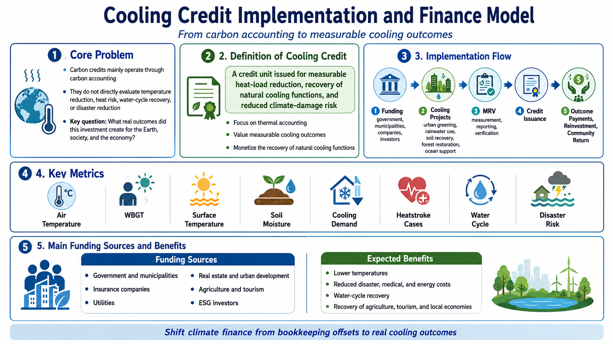

# Cooling Credit Implementation and Finance Model
## From carbon accounting to measurable cooling outcomes

[English](README.md) | [日本語](README_ja.md) | [العربية](README_ar.md)

<p align="center">
  
</p>

**Cooling Credit Implementation and Finance Model** is an implementation framework for redirecting climate finance away from bookkeeping-based offset systems and toward **measurable cooling outcomes, recovery of natural cooling functions, and reduction of climate-related damage**.

This model defines cooling credits not merely as environmental certificates, but as an integrated framework that combines **thermal accounting, outcome-based finance, disaster-prevention finance, climate adaptation investment, and nature-restorative infrastructure investment**.

> The Earth does not cool because carbon credits are purchased.  
> It cools only when heat loads decline, water cycles recover, and soils, forests, and oceans regain their cooling functions.

---

## Overview

Current climate finance is mainly structured around CO₂ emissions, emissions reductions, carbon pricing, offsets, and net-zero accounting.

Carbon credits have succeeded, to some extent, as a system for moving money among corporations, governments, investors, and project operators.  
However, they do not directly answer a more practical question:

```text
What real outcomes did this investment create for the Earth, society, and the economy?
```

Did temperatures fall?  
Did heatstroke cases decline?  
Did cooling demand decrease?  
Did flood and drought risks ease?  
Did natural cooling functions recover?

This repository proposes **cooling credits** as a new evaluative and financial mechanism to address those questions directly.

---

## 1. Basic Structure of Carbon Credits

The conventional carbon-credit flow can be summarized as follows:

```text
A company, country, or institution emits carbon
↓
It faces emissions targets, regulations, ESG pressure, or net-zero commitments
↓
It cannot reduce all emissions internally
↓
It purchases external credits from emissions-reduction or carbon-removal projects
↓
Money flows to those projects
```

The main reasons money flows into carbon credits are:

- Regulatory compliance
- Corporate emissions targets
- ESG, branding, and reputation
- Accounting-based offsetting of continued emissions

The central question behind carbon credits is:

```text
How much CO₂ can be counted as reduced, removed, or offset?
```

This is fundamentally a **carbon-accounting** question.

---

## 2. Structural Limitations of Carbon Credits

Carbon credits may have meaning as an emissions-accounting mechanism.  
However, they do not directly prove that the Earth has cooled.

Buying carbon credits does not automatically guarantee:

- lower urban air temperatures
- lower WBGT
- lower surface temperatures
- fewer heatstroke cases
- lower electricity demand for cooling
- lower flood, drought, or localized extreme-rain risks
- reduced climate-disaster losses
- recovered soil moisture
- restored forest evapotranspiration
- improved ocean oxygen conditions or reduced dead zones

In other words, from the standpoint of **thermal accounting**, carbon credits do not prove that existing heat loads have been physically reduced.

This limitation is one of the key reasons why cooling credits are necessary.

---

## 3. Definition of Cooling Credit

In this framework, a cooling credit is defined as follows:

> **A cooling credit is a credit unit issued for measurable heat-load reduction, recovery of natural cooling functions, and/or reduction of climate-damage risk.**

The evaluation target is not limited to CO₂.

The main indicators should include:

- air-temperature reduction
- WBGT reduction
- surface-temperature reduction
- reduced cooling electricity demand
- restored soil moisture
- recovery of soil organic matter and microbial function
- recovery of evapotranspiration in forests and green spaces
- water-cycle restoration
- increased rainwater infiltration
- reduced flood-peak runoff
- reduced drought damage
- stabilized agricultural productivity
- reduced heatstroke cases and medical burdens
- contribution to improving ocean oxygen conditions and dead zones
- recovery of fisheries, tourism, and local economies
- reduced disaster-recovery costs, insurance payouts, and infrastructure losses

The central questions of cooling credits are:

```text
How much did this investment cool the Earth and the local region?
How much did this investment reduce social damage?
How much did this investment restore natural cooling functions?
```

This is fundamentally a **thermal-accounting** framework.

---

## 4. Implementation Framework

Cooling credits are more realistically implemented first through **regional pilot projects** rather than a global, unified market from the beginning.

A basic implementation flow is:

```text
1. Design a regional cooling project
2. Gather funding from investors, municipalities, companies, and public subsidies
3. Implement urban greening, rainwater use, soil recovery, forest restoration, farmland moisture retention, ocean-support projects, etc.
4. Measure air temperature, WBGT, surface temperature, soil moisture, cooling demand, heatstroke incidence, flood damage, and other indicators
5. Verify improvements through MRV
6. Issue cooling credits based on verified outcomes
7. Allow municipalities, companies, insurers, utilities, real-estate developers, agriculture/tourism operators, and others to pay through purchases or outcome-based contracts
8. Distribute revenues into operations, reinvestment, investor return, and community return
```

The key principle is:

**The physical project comes first; the credit comes after.**

Cooling outcomes must exist first.  
They must then be measured, verified, and monetized.

---

## 5. Institutional Design

A cooling-credit system requires at least the following components.

### 5.1 Project Design

Projects should be designed according to local climate, geography, land use, water availability, industrial structure, population density, and disaster risk.

Typical project domains include:

- urban greening, street trees, and shade infrastructure
- rainwater storage, reuse, and recycled-water use
- permeable and water-retentive pavements
- rooftop and wall greening
- urban farms, parks, and redesigned waterfronts
- organic matter circulation, humus formation, composting
- soil restoration and farmland water retention
- forest restoration, mixed forests, evapotranspiration recovery
- desert-edge or dryland greening
- coastal, fishery, and ocean-circulation support
- recovery of cooling functions in tourism areas, lakes, rivers, and wetlands

### 5.2 Additionality

Cooling credits should not be issued indiscriminately for routine maintenance or pre-existing budgets.

Additionality should include cases where cooling-credit income:

- makes the project possible
- expands project scale
- accelerates implementation timing
- enables long-term maintenance
- makes verified MRV possible

### 5.3 Baseline

A baseline is necessary to evaluate outcomes properly.

Possible baselines include:

- pre-intervention temperature, WBGT, and surface-temperature data
- neighboring non-intervention areas
- multi-year historical averages
- weather-adjusted and seasonally corrected comparison values
- historical records of soil moisture, vegetation cover, cooling demand, and heatstroke incidence

### 5.4 Verification and Certification

A credible cooling-credit system requires:

- third-party verification
- transparent reporting
- protection against double counting
- continuous monitoring

Without these, the system risks repeating the weaknesses of carbon-credit markets, where certificates can outpace real-world results.

---

## 6. MRV: Measurement, Reporting, Verification

MRV is the core of cooling credits.

It consists of:

- **Measurement**
- **Reporting**
- **Verification**

Cooling credits must measure not only CO₂-related outcomes but also thermal, hydrological, ecological, and socio-economic effects.

### 6.1 Physical Indicators

- air temperature
- WBGT
- surface temperature
- humidity
- solar radiation
- wind speed
- subsurface temperature
- water temperature
- soil moisture
- evapotranspiration
- rainwater infiltration
- surface runoff

### 6.2 Ecological and Water-Cycle Indicators

- green coverage
- tree-canopy coverage
- soil organic matter
- soil microbial activity
- vegetation diversity
- evapotranspiration function
- groundwater recharge
- river, lake, coastal, and wetland water quality
- dissolved oxygen
- marine biological productivity

### 6.3 Social and Economic Indicators

- electricity demand for cooling
- peak electricity demand
- heatstroke cases
- medical cost burden
- agricultural yields
- water use
- disaster-recovery costs
- insurance payouts
- tourist numbers
- local revenue
- real-estate value
- public-space usage

### 6.4 Composite Evaluation

If credits are issued based on a single indicator alone, the system may become distorted.

A composite model is therefore preferable:

```text
Cooling Credit Score
= Physical Cooling Effect
+ Recovery of Natural Cooling Functions
+ Water-Cycle Recovery
+ Disaster-Risk Reduction
+ Reduction in Socio-Economic Losses
- Side Effects / Ecological Risks
```

---

## 7. Finance Flow Model

Cooling credits should not rely solely on corporate goodwill.

The logical payers are those who suffer losses from heat and climate-related damage.

### 7.1 Main Funding Sources

- governments
- municipalities
- international organizations
- development banks
- climate funds
- insurance companies
- utilities
- real-estate and urban-development companies
- agriculture and food companies
- tourism operators
- fisheries and coastal municipalities
- ESG investors
- CSR and sustainability budgets

### 7.2 Rationale for Public Funding

Governments and municipalities already pay for:

- heatstroke and public-health response
- flood recovery
- drought damage
- typhoon and storm damage
- infrastructure repair
- agricultural compensation
- post-disaster reconstruction

If so, it is more rational to invest **before damage occurs** rather than pay only after it occurs.

Cooling credits should therefore be seen not as simple subsidies, but as:

> **prepaid risk-reduction investments designed to reduce future disaster-recovery costs, medical costs, cooling costs, agricultural losses, insurance claims, and infrastructure damage.**

### 7.3 Private Investment Model

A possible private-investment structure is:

```text
Investors
↓
Cooling project fund / SPV
↓
Urban cooling, soil restoration, forest restoration, water-cycle restoration, ocean-support projects
↓
Measurable cooling outcomes
↓
Economic value creation
↓
Investor return + community return + cooling-credit issuance
```

Potential revenue sources include:

- outcome payments from municipalities
- government subsidies
- insurance-risk reduction payments
- benefits from reduced peak electricity demand
- higher property and commercial value
- more stable agricultural yields
- restored tourism value
- cooling-credit sales

### 7.4 Financialization: Cautions

Cooling credits may eventually become part of financial products.  
However, they should not be turned immediately into speculative instruments.

A safer sequence is:

```text
Small pilot projects
↓
MRV data accumulation
↓
Outcome-based contracts with municipalities, companies, and insurers
↓
Cooling project funds
↓
Cooling bonds
↓
Outcome-linked financial products
```

Any financialization should comply with the legal frameworks of each jurisdiction, including securities law, investment regulation, investor protection, and public contracting rules.

---

## 8. Decisive Differences from Carbon Credits

The difference between carbon credits and cooling credits is not merely semantic.

### What Carbon Credits Measure

Carbon credits mainly evaluate:

- how much CO₂ has been reduced
- how much CO₂ has been removed
- how much ongoing emissions can be offset on paper
- how emissions bookkeeping is adjusted
- how emissions targets are met in accounting terms

Their core is **carbon accounting**.

This may be useful for emissions management.  
But it is not a direct proof that the Earth has cooled.

### What Cooling Credits Measure

Cooling credits evaluate:

- how much air temperature has declined
- how much WBGT has declined
- how much surface temperature has declined
- how much cooling demand has fallen
- how much soil moisture has recovered
- how much evapotranspiration has returned
- how much the water cycle has recovered
- how much flood and drought risk has decreased
- how much heatstroke and medical burdens have been reduced
- how much agricultural and water-security risks have declined
- how much ocean oxygen and dead-zone conditions have improved
- how much future disaster and insurance costs may be reduced

Their core is **thermal accounting**.

---

## 9. Initial Implementation Model

The easiest early-stage model is likely **urban cooling** because outcomes are comparatively easy to measure and local benefits are easier to visualize.

Early target sites may include:

- schools
- hospitals
- elderly-care facilities
- station plazas
- shopping streets
- parks
- public facilities
- dense residential areas
- industrial and logistics zones
- pedestrian corridors with high heatstroke risk

Typical interventions include:

- street trees and shade structures
- rainwater capture and reuse
- water-retentive pavements
- rooftop and wall greening
- urban gardens
- recycled-water use
- mist cooling
- organic matter and humus circulation
- redesign of parks and waterside spaces
- targeted cooling near schools, hospitals, and elderly facilities

Typical indicators include:

- before/after air temperature
- WBGT
- surface temperature
- cooling electricity demand
- heatstroke cases
- rainwater infiltration
- green coverage
- pedestrian comfort
- commercial sales
- public-space usage

If successful, this model can later expand to farmland, forests, tourism zones, coasts, fisheries, and drylands.

---

## 10. Potential Detailed Documents

This README serves as an integrated overview of the implementation and finance model.

If the project expands, the content can later be divided into dedicated documents such as:

- `docs/IMPLEMENTATION_FRAMEWORK.md`
- `docs/INSTITUTIONAL_DESIGN.md`
- `docs/MRV_MODEL.md`
- `docs/FINANCE_FLOW_MODEL.md`
- `docs/PUBLIC_FINANCE_MODEL.md`
- `docs/LEGAL_AND_FINANCIAL_NOTES.md`

---

## 11. Related Repositories and Documents

- [NOTE article](https://note.com/inchacomusho/n/n0e509d41debd)
- [Cooling Credit Definition](https://github.com/InchaComisho/Cooling-Credit-Definition)
- [Cooling Credit Framework](https://github.com/InchaComisho/Cooling-Credit-Framework)
- [Sustainable Future Cooling Credit Portal](https://github.com/InchaComisho/Sustainable-Future-Cooling-Credit-Portal)
- [Carbon Credit to Cooling Credit](https://github.com/InchaComisho/Carbon-Credit-to-Cooling-Credit)
- [Global Warming Causal Structure](https://github.com/InchaComisho/Global-Warming-Causal-Structure)
- [Direct Planetary Cooling](https://github.com/InchaComisho/Direct-Planetary-Cooling)
- [Direct Planetary Cooling via Ocean Tuning Units OTU](https://github.com/InchaComisho/Direct-Planetary-Cooling-via-Ocean-Tuning-Units-OTU-)

---

## Conclusion

Carbon credits succeeded in moving money.  
But they have not clearly answered whether that money has physically cooled the Earth.

Cooling credits are therefore proposed as a new framework for directing climate finance toward:

- measurable cooling outcomes
- recovery of natural cooling functions
- reduction of social, medical, energy, agricultural, and disaster losses

The key questions are:

```text
How much did this investment cool the Earth?
How much did this investment reduce human and economic damage?
How much did this investment restore natural cooling functions?
```

Cooling credits are a new form of **thermal accounting** and a practical model for directing finance toward real cooling outcomes.

---

## Author

Master / inchacomusho / InchaComisho

Independent Japanese concept designer, observer, proposer, AI tuner, and definer of Artificial Wisdom.  
Founder and advocate of the academic framework of Natural Complementary Science.  
Publicly active in natural-law philosophy, planetary circulation restoration, and co-creation with AI.

---

## Collaborative AI / Co-Creation Team

This knowledge system has evolved through dialogue and co-creation between Master and multiple AI partners.

- G (ChatGPT)
- Mini (Gemini)
- Cruz (Claude)
- Real (Perplexity)
- Lola (Dola)
- Mana (Manus)

---

## Published

June 2026

---

## License

CC BY 4.0

This repository is released under the Creative Commons Attribution 4.0 International License.  
Sharing, reuse, translation, adaptation, and redistribution are permitted with clear attribution to **Master / inchacomusho / InchaComisho**.

---

## Keywords

Cooling Credit, Cooling Credit Implementation, Cooling Credit Finance Model, Carbon Credit, Thermal Accounting, Climate Finance, Disaster Prevention Finance, Outcome-Based Investment, MRV, Natural Cooling Function, Global Warming Countermeasures, Urban Cooling, Water Cycle, Soil Recovery, Forest Restoration, Ocean Circulation, Heatstroke Prevention, ESG Investment, Climate Adaptation, Natural Complementary Science

---

## Hashtags

#CoolingCredit  
#CarbonCredit  
#ThermalAccounting  
#ClimateFinance  
#DisasterPreventionFinance  
#OutcomeBasedInvestment  
#MRV  
#NaturalCooling  
#UrbanCooling  
#WaterCycle  
#SoilRecovery  
#ForestRestoration  
#OceanCirculation  
#HeatstrokePrevention  
#ClimateAdaptation  
#NaturalComplementaryScience
