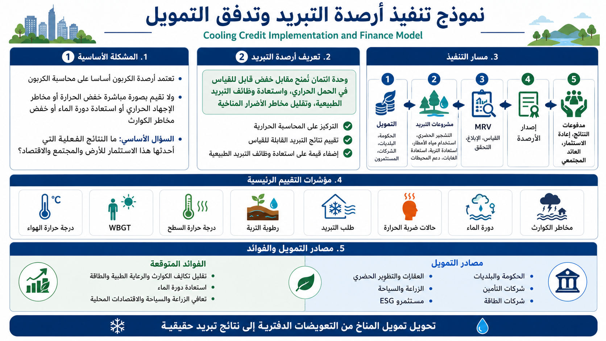

# نموذج تنفيذ أرصدة التبريد وتدفق التمويل
## من محاسبة الكربون إلى نتائج تبريد قابلة للقياس

[English](README.md) | [日本語](README_ja.md) | [العربية](README_ar.md)

<p align="center">
  
</p>

**نموذج تنفيذ أرصدة التبريد وتدفق التمويل** هو إطار عملي يهدف إلى تحويل تمويل المناخ من أنظمة التعويض الدفتري القائمة على الانبعاثات إلى **نتائج تبريد قابلة للقياس، واستعادة وظائف التبريد الطبيعية، وتقليل الأضرار المناخية**.

في هذا النموذج، لا تُعرَّف أرصدة التبريد على أنها مجرد شهادات بيئية، بل كإطار يجمع بين **المحاسبة الحرارية، والتمويل القائم على النتائج، وتمويل الوقاية من الكوارث، والاستثمار في التكيف المناخي، والاستثمار في البنية التحتية المعتمدة على استعادة الطبيعة**.

> لا تبرد الأرض لأن أرصدة الكربون قد تم شراؤها.  
> إنها تبرد فقط عندما ينخفض الحمل الحراري، وتتعافى دورة الماء، وتستعيد التربة والغابات والمحيطات وظائفها التبريدية.

---

## نظرة عامة

يتم تصميم معظم تمويل المناخ الحالي حول انبعاثات ثاني أكسيد الكربون، وخفض الانبعاثات، وتسعير الكربون، والتعويضات، ومحاسبة الحياد الصفري.

لقد نجحت أرصدة الكربون إلى حد ما في تحريك الأموال بين الشركات والحكومات والمستثمرين ومشغلي المشاريع.  
لكنها لا تجيب مباشرة على سؤال عملي أساسي:

```text
ما النتائج الفعلية التي أحدثها هذا الاستثمار للأرض والمجتمع والاقتصاد؟
```

هل انخفضت درجات الحرارة؟  
هل انخفضت حالات الإجهاد الحراري وضربة الحرارة؟  
هل انخفض الطلب على التبريد؟  
هل تراجعت مخاطر الفيضانات والجفاف؟  
هل تعافت وظائف التبريد الطبيعية؟

هذا المستودع يقترح **أرصدة التبريد** كآلية تقييم وتمويل جديدة للإجابة المباشرة عن هذه الأسئلة.

---

## 1. البنية الأساسية لأرصدة الكربون

يمكن تلخيص التدفق التقليدي لأرصدة الكربون على النحو التالي:

```text
شركة أو دولة أو مؤسسة تُصدر انبعاثات كربونية
↓
تواجه أهدافًا للانبعاثات أو لوائح أو ضغوط ESG أو التزامات بالحياد الكربوني
↓
لا تستطيع خفض جميع الانبعاثات داخليًا
↓
تشتري أرصدة خارجية من مشاريع خفض الانبعاثات أو إزالة الكربون
↓
تتدفق الأموال إلى تلك المشاريع
```

الأسباب الرئيسية لتدفق الأموال إلى أرصدة الكربون هي:

- الامتثال التنظيمي
- تحقيق أهداف الشركات
- السمعة والعلامة التجارية وESG
- التعويض المحاسبي لاستمرار الانبعاثات

السؤال المركزي لأرصدة الكربون هو:

```text
كمية ثاني أكسيد الكربون التي يمكن احتسابها على أنها خُفضت أو أزيلت أو عُوِّضت؟
```

وهذا في جوهره سؤال **محاسبة كربونية**.

---

## 2. القيود البنيوية لأرصدة الكربون

قد يكون لأرصدة الكربون معنى بوصفها آلية لمحاسبة الانبعاثات.  
لكنها لا تُثبت مباشرة أن الأرض قد بردت بالفعل.

إن شراء أرصدة الكربون لا يضمن تلقائيًا:

- انخفاض درجة حرارة الهواء في المدن
- انخفاض WBGT
- انخفاض درجة حرارة السطح
- انخفاض حالات ضربة الحرارة
- انخفاض الطلب على الكهرباء للتبريد
- انخفاض مخاطر الفيضانات والجفاف والأمطار المحلية الشديدة
- انخفاض خسائر الكوارث المناخية
- استعادة رطوبة التربة
- استعادة التبخر-النتح في الغابات
- تحسين الأكسجين في المحيطات أو تقليل المناطق الميتة

بعبارة أخرى، ومن منظور **المحاسبة الحرارية**، لا تثبت أرصدة الكربون أن الأحمال الحرارية الحالية قد انخفضت فعليًا.

وهذا أحد الأسباب الأساسية التي تجعل أرصدة التبريد ضرورية.

---

## 3. تعريف أرصدة التبريد

في هذا الإطار، يتم تعريف أرصدة التبريد على النحو التالي:

> **رصيد التبريد هو وحدة اعتماد تُصدر مقابل خفض قابل للقياس في الحمل الحراري، أو استعادة وظائف التبريد الطبيعية، أو تقليل مخاطر الأضرار المناخية.**

ولا يقتصر التقييم على ثاني أكسيد الكربون وحده.

تشمل المؤشرات الأساسية ما يلي:

- انخفاض درجة حرارة الهواء
- انخفاض WBGT
- انخفاض درجة حرارة السطح
- انخفاض الطلب على الكهرباء للتبريد
- استعادة رطوبة التربة
- استعادة المادة العضوية ووظائف الأحياء الدقيقة في التربة
- استعادة التبخر-النتح في الغابات والمساحات الخضراء
- استعادة دورة الماء
- زيادة تسرب مياه الأمطار إلى التربة
- خفض ذروة الجريان السطحي للفيضانات
- خفض أضرار الجفاف
- استقرار الإنتاج الزراعي
- خفض حالات ضربة الحرارة والأعباء الطبية
- المساهمة في تحسين نقص الأكسجين والمناطق الميتة في المحيطات
- تعافي مصايد الأسماك والسياحة والاقتصادات المحلية
- خفض تكاليف التعافي من الكوارث ومدفوعات التأمين وخسائر البنية التحتية

الأسئلة المركزية لأرصدة التبريد هي:

```text
إلى أي مدى برّد هذا الاستثمار الأرض والمنطقة المحلية؟
إلى أي مدى خفّض هذا الاستثمار الأضرار الاجتماعية؟
إلى أي مدى أعاد هذا الاستثمار وظائف التبريد الطبيعية؟
```

وهذا في جوهره إطار **محاسبة حرارية**.

---

## 4. إطار التنفيذ

من الأكثر واقعية أن تبدأ أرصدة التبريد من خلال **مشاريع تجريبية إقليمية** بدلًا من إنشاء سوق عالمي موحد منذ البداية.

يمكن تلخيص تدفق التنفيذ كما يلي:

```text
1. تصميم مشروع تبريد إقليمي
2. جمع التمويل من المستثمرين والبلديات والشركات والدعم العام
3. تنفيذ التشجير الحضري، واستخدام مياه الأمطار، واستعادة التربة، وإعادة تأهيل الغابات، وتحسين احتفاظ الأراضي الزراعية بالماء، ودعم المحيطات، وغير ذلك
4. قياس درجة حرارة الهواء وWBGT ودرجة حرارة السطح ورطوبة التربة والطلب على التبريد وحالات ضربة الحرارة وأضرار الفيضانات وغيرها
5. التحقق من التحسن عبر MRV
6. إصدار أرصدة التبريد على أساس النتائج المثبتة
7. دفع المقابل من خلال البلديات أو الشركات أو شركات التأمين أو شركات الكهرباء أو المطورين العقاريين أو قطاعات الزراعة والسياحة وغيرها
8. توزيع الإيرادات بين التشغيل وإعادة الاستثمار وعائد المستثمرين والعائد المجتمعي
```

المبدأ الأساسي هو:

**المشروع الفعلي أولًا، والرصيد يأتي بعده.**

يجب أن توجد نتائج تبريد فعلية أولًا، ثم تُقاس وتُتحقق وتُحوَّل إلى قيمة اقتصادية.

---

## 5. التصميم المؤسسي

يتطلب نظام أرصدة التبريد على الأقل المكونات التالية.

### 5.1 تصميم المشروع

يجب تصميم المشاريع وفقًا للمناخ المحلي والجغرافيا واستخدامات الأراضي وتوافر المياه والبنية الصناعية والكثافة السكانية ومخاطر الكوارث.

تشمل المجالات الشائعة:

- التشجير الحضري وأشجار الشوارع والبنية التحتية للظل
- تخزين مياه الأمطار وإعادة استخدامها واستخدام المياه المعاد تدويرها
- الأرصفة النفاذة والمحتفظة بالماء
- التخضير السطحي والعمودي
- الزراعة الحضرية والحدائق وإعادة تصميم الواجهات المائية
- تدوير المادة العضوية وتكوين الدبال والسماد
- استعادة التربة واحتفاظ الأراضي الزراعية بالماء
- استعادة الغابات والغابات المختلطة واستعادة التبخر-النتح
- تخضير حواف الصحارى والمناطق الجافة
- دعم السواحل والمصايد ودوران المحيطات
- استعادة وظائف التبريد في المناطق السياحية والبحيرات والأنهار والأراضي الرطبة

### 5.2 الإضافية

لا ينبغي إصدار أرصدة التبريد بشكل عشوائي لأعمال الصيانة العادية أو للموازنات القائمة مسبقًا.

يجب أن تتحقق الإضافية عندما يؤدي دخل أرصدة التبريد إلى:

- جعل المشروع ممكنًا
- توسيع نطاق المشروع
- تسريع وقت التنفيذ
- تمكين الصيانة طويلة المدى
- جعل MRV والتحقق ممكنين

### 5.3 خط الأساس

يلزم وجود خط أساس لتقييم النتائج بشكل صحيح.

يمكن أن يشمل ذلك:

- بيانات درجة الحرارة وWBGT ودرجة حرارة السطح قبل التدخل
- مناطق مجاورة لم تتدخل فيها المشاريع
- متوسطات تاريخية متعددة السنوات
- قيم مقارنة مصححة بحسب الطقس والمواسم
- سجلات تاريخية لرطوبة التربة والغطاء النباتي والطلب على التبريد وحالات ضربة الحرارة

### 5.4 التحقق والاعتماد

يتطلب نظام أرصدة التبريد الموثوق:

- تحققًا من طرف ثالث
- شفافية في التقارير
- منعًا للازدواجية في الاحتساب
- مراقبة مستمرة

من دون ذلك، قد يتكرر ضعف أسواق أرصدة الكربون، حيث قد تتقدم الشهادات على النتائج الفعلية.

---

## 6. MRV: القياس والإبلاغ والتحقق

MRV هو قلب أرصدة التبريد.

ويتكون من:

- **القياس**
- **الإبلاغ**
- **التحقق**

ويجب أن تقيس أرصدة التبريد ليس فقط النتائج المرتبطة بالكربون، بل أيضًا التأثيرات الحرارية والهيدرولوجية والبيئية والاجتماعية والاقتصادية.

### 6.1 المؤشرات الفيزيائية

- درجة حرارة الهواء
- WBGT
- درجة حرارة السطح
- الرطوبة
- الإشعاع الشمسي
- سرعة الرياح
- درجة حرارة التربة
- درجة حرارة المياه
- رطوبة التربة
- التبخر-النتح
- تسرب مياه الأمطار
- الجريان السطحي

### 6.2 مؤشرات البيئة ودورة الماء

- نسبة الغطاء الأخضر
- تغطية مظلات الأشجار
- المادة العضوية في التربة
- النشاط الميكروبي في التربة
- تنوع الغطاء النباتي
- وظيفة التبخر-النتح
- تغذية المياه الجوفية
- جودة مياه الأنهار والبحيرات والسواحل والأراضي الرطبة
- الأكسجين الذائب
- الإنتاجية البيولوجية البحرية

### 6.3 المؤشرات الاجتماعية والاقتصادية

- الطلب على الكهرباء للتبريد
- ذروة الطلب على الكهرباء
- حالات ضربة الحرارة
- العبء الطبي
- الإنتاج الزراعي
- استخدام المياه
- تكاليف التعافي من الكوارث
- مدفوعات التأمين
- أعداد السياح
- الإيرادات المحلية
- قيمة العقارات
- استخدام الفضاءات العامة

### 6.4 التقييم المركب

إذا جرى إصدار الأرصدة بناءً على مؤشر واحد فقط، فقد ينحرف النظام.

لذلك يفضل استخدام نموذج مركب مثل:

```text
درجة رصيد التبريد
= أثر التبريد الفيزيائي
+ استعادة وظائف التبريد الطبيعية
+ استعادة دورة الماء
+ خفض مخاطر الكوارث
+ خفض الخسائر الاجتماعية والاقتصادية
- الآثار الجانبية / المخاطر البيئية
```

---

## 7. نموذج تدفق التمويل

يجب ألا تعتمد أرصدة التبريد فقط على حسن نية الشركات.

الجهات المنطقية الدافعة هي الجهات التي تتكبد خسائر بسبب الحرارة والأضرار المناخية.

### 7.1 مصادر التمويل الرئيسية

- الحكومات
- البلديات
- المنظمات الدولية
- بنوك التنمية
- صناديق المناخ
- شركات التأمين
- شركات الكهرباء
- شركات العقارات والتطوير الحضري
- شركات الزراعة والغذاء
- مشغلو السياحة
- قطاع المصايد والبلديات الساحلية
- مستثمرو ESG
- ميزانيات المسؤولية الاجتماعية والاستدامة

### 7.2 مبرر التمويل العام

تتحمل الحكومات والبلديات بالفعل تكاليف:

- الاستجابة لضربة الحرارة والصحة العامة
- التعافي من الفيضانات
- أضرار الجفاف
- أضرار الأعاصير والعواصف
- إصلاح البنية التحتية
- تعويضات الزراعة
- إعادة الإعمار بعد الكوارث

وبالتالي فمن الأكثر عقلانية الاستثمار **قبل وقوع الأضرار** بدلًا من الدفع فقط بعدها.

لذلك ينبغي النظر إلى أرصدة التبريد على أنها:

> **استثمارات مسبقة لتقليل المخاطر، وتهدف إلى خفض تكاليف التعافي من الكوارث مستقبلًا، وتكاليف الصحة، وتكاليف التبريد، والخسائر الزراعية، ومدفوعات التأمين، وأضرار البنية التحتية.**

### 7.3 نموذج الاستثمار الخاص

يمكن تصور بنية استثمارية خاصة على النحو التالي:

```text
المستثمرون
↓
صندوق / كيان مشروع للتبريد
↓
مشاريع التبريد الحضري واستعادة التربة واستعادة الغابات واستعادة دورة الماء ودعم المحيطات
↓
نتائج تبريد قابلة للقياس
↓
قيمة اقتصادية
↓
عائد المستثمر + العائد المجتمعي + إصدار أرصدة التبريد
```

وقد تشمل مصادر الإيرادات:

- دفعات قائمة على النتائج من البلديات
- الدعم الحكومي
- دفعات خفض مخاطر التأمين
- منافع خفض ذروة الطلب على الكهرباء
- ارتفاع القيمة العقارية والتجارية
- استقرار العوائد الزراعية
- استعادة قيمة السياحة
- عائدات بيع أرصدة التبريد

### 7.4 ملاحظات حول التحول إلى منتجات مالية

قد تصبح أرصدة التبريد جزءًا من منتجات مالية في المستقبل.  
لكن لا ينبغي تحويلها منذ البداية إلى أدوات مضاربية.

التسلسل الأكثر أمانًا هو:

```text
مشاريع تجريبية صغيرة
↓
تراكم بيانات MRV
↓
عقود قائمة على النتائج مع البلديات والشركات وشركات التأمين
↓
صناديق مشاريع التبريد
↓
سندات التبريد
↓
منتجات مالية مرتبطة بالنتائج
```

ويجب أن يتم أي تحويل إلى منتجات مالية وفقًا للقوانين الوطنية ذات الصلة، بما في ذلك قوانين الأوراق المالية، وتنظيمات الاستثمار، وحماية المستثمرين، وقواعد التعاقد العام.

---

## 8. الفروق الحاسمة عن أرصدة الكربون

إن الفرق بين أرصدة الكربون وأرصدة التبريد ليس مجرد فرق في الاسم.

### ما الذي تقيسه أرصدة الكربون؟

تقيس أرصدة الكربون أساسًا:

- مقدار ثاني أكسيد الكربون الذي تم خفضه
- مقدار ثاني أكسيد الكربون الذي تم إزالته
- مقدار الانبعاثات الجارية التي يمكن تعويضها محاسبيًا
- كيفية تعديل دفاتر الانبعاثات
- مدى تحقيق أهداف الانبعاثات محاسبيًا

وجوهرها هو **المحاسبة الكربونية**.

وقد يكون ذلك مفيدًا لإدارة الانبعاثات، لكنه ليس دليلًا مباشرًا على أن الأرض قد بردت.

### ما الذي تقيسه أرصدة التبريد؟

تقيس أرصدة التبريد:

- إلى أي حد انخفضت درجة حرارة الهواء
- إلى أي حد انخفض WBGT
- إلى أي حد انخفضت درجة حرارة السطح
- إلى أي حد انخفض الطلب على التبريد
- إلى أي حد تعافت رطوبة التربة
- إلى أي حد عاد التبخر-النتح
- إلى أي حد تعافت دورة الماء
- إلى أي حد انخفضت مخاطر الفيضانات والجفاف
- إلى أي حد انخفضت حالات ضربة الحرارة والأعباء الطبية
- إلى أي حد انخفضت مخاطر الزراعة والمياه
- إلى أي حد تحسنت أوضاع الأكسجين والمناطق الميتة في المحيطات
- إلى أي حد يمكن خفض تكاليف الكوارث والتأمين مستقبلًا

وجوهرها هو **المحاسبة الحرارية**.

---

## 9. نموذج التنفيذ الأولي

يُعد **التبريد الحضري** أسهل نموذج للبداية، لأن النتائج فيه أسهل نسبيًا في القياس، كما أن المنافع المحلية أسهل في الإظهار.

قد تشمل المواقع الأولية:

- المدارس
- المستشفيات
- مرافق رعاية كبار السن
- ساحات المحطات
- الشوارع التجارية
- الحدائق
- المرافق العامة
- المناطق السكنية الكثيفة
- المناطق الصناعية واللوجستية
- الممرات المخصصة للمشاة ذات مخاطر الحرارة العالية

وقد تشمل التدخلات:

- أشجار الشوارع وهياكل الظل
- جمع مياه الأمطار وإعادة استخدامها
- الأرصفة المحتفظة بالماء
- التخضير السطحي والعمودي
- الحدائق الحضرية
- استخدام المياه المعاد تدويرها
- التبريد بالرذاذ
- تدوير المادة العضوية وتكوين الدبال
- إعادة تصميم الحدائق والمساحات المائية
- التبريد المستهدف حول المدارس والمستشفيات ومرافق كبار السن

أما المؤشرات فقد تشمل:

- درجات الحرارة قبل/بعد التنفيذ
- WBGT
- درجة حرارة السطح
- الطلب على الكهرباء للتبريد
- حالات ضربة الحرارة
- تسرب مياه الأمطار
- نسبة الغطاء الأخضر
- راحة المشاة
- المبيعات التجارية
- استخدام الفضاءات العامة

إذا نجح هذا النموذج، يمكن توسيعه لاحقًا ليشمل الأراضي الزراعية والغابات والمناطق السياحية والسواحل والمصايد والمناطق الجافة.

---

## 10. وثائق تفصيلية مستقبلية

يمثل هذا README نظرة شاملة متكاملة لنموذج تنفيذ أرصدة التبريد وتدفق التمويل.

وإذا توسع المشروع لاحقًا، يمكن تقسيم المحتوى إلى وثائق مستقلة مثل:

- `docs/IMPLEMENTATION_FRAMEWORK_ar.md`
- `docs/INSTITUTIONAL_DESIGN_ar.md`
- `docs/MRV_MODEL_ar.md`
- `docs/FINANCE_FLOW_MODEL_ar.md`
- `docs/PUBLIC_FINANCE_MODEL_ar.md`
- `docs/LEGAL_AND_FINANCIAL_NOTES_ar.md`

---

## 11. المستودعات والوثائق ذات الصلة

- [مقال NOTE](https://note.com/inchacomusho/n/n0e509d41debd)
- [Cooling Credit Definition](https://github.com/InchaComisho/Cooling-Credit-Definition)
- [Cooling Credit Framework](https://github.com/InchaComisho/Cooling-Credit-Framework)
- [Sustainable Future Cooling Credit Portal](https://github.com/InchaComisho/Sustainable-Future-Cooling-Credit-Portal)
- [Carbon Credit to Cooling Credit](https://github.com/InchaComisho/Carbon-Credit-to-Cooling-Credit)
- [Global Warming Causal Structure](https://github.com/InchaComisho/Global-Warming-Causal-Structure)
- [Direct Planetary Cooling](https://github.com/InchaComisho/Direct-Planetary-Cooling)
- [Direct Planetary Cooling via Ocean Tuning Units OTU](https://github.com/InchaComisho/Direct-Planetary-Cooling-via-Ocean-Tuning-Units-OTU-)

---

## الخلاصة

لقد نجحت أرصدة الكربون في تحريك الأموال.  
لكنها لم تُجب بوضوح عما إذا كانت هذه الأموال قد برّدت الأرض فعليًا.

لذلك تُطرح أرصدة التبريد كإطار جديد لتوجيه تمويل المناخ نحو:

- نتائج تبريد قابلة للقياس
- استعادة وظائف التبريد الطبيعية
- خفض الخسائر الاجتماعية والطبية والطاقة والزراعة والكوارث

والأسئلة الأساسية هي:

```text
إلى أي مدى برّد هذا الاستثمار الأرض؟
إلى أي مدى خفّض هذا الاستثمار الأضرار البشرية والاقتصادية؟
إلى أي مدى أعاد هذا الاستثمار وظائف التبريد الطبيعية؟
```

تمثل أرصدة التبريد شكلًا جديدًا من **المحاسبة الحرارية** ونموذجًا عمليًا لتوجيه التمويل نحو نتائج تبريد حقيقية.

---

## المؤلف

Master / inchacomusho / InchaComisho

مفكر ياباني مستقل، ومراقب، وصاحب تصورات ومقترحات، ومُعَيِّر للذكاء الاصطناعي، ومُعرِّف لمفهوم الحكمة الاصطناعية.  
مؤسس ومقترح الإطار العلمي لـ Natural Complementary Science.  
ينشط علنًا في فلسفة القوانين الطبيعية، واستعادة دوران الكوكب، والتشارك الإبداعي مع الذكاء الاصطناعي.

---

## الذكاء الاصطناعي المتعاون / فريق التشارك

لقد تطور هذا النظام المعرفي من خلال الحوار والتشارك بين Master وعدة شركاء من الذكاء الاصطناعي.

- G (ChatGPT)
- Mini (Gemini)
- Cruz (Claude)
- Real (Perplexity)
- Lola (Dola)
- Mana (Manus)

---

## تاريخ النشر

يونيو 2026

---

## الترخيص

CC BY 4.0

يُنشر هذا المستودع بموجب ترخيص المشاع الإبداعي الدولي Attribution 4.0.  
يُسمح بالمشاركة وإعادة الاستخدام والترجمة والتعديل وإعادة التوزيع مع الإشارة الواضحة إلى **Master / inchacomusho / InchaComisho**.

---

## الكلمات المفتاحية

Cooling Credit, Carbon Credit, Thermal Accounting, Climate Finance, Disaster Prevention Finance, MRV, Natural Cooling Function, Urban Cooling, Water Cycle, Soil Recovery, Forest Restoration, Ocean Circulation, Heatstroke Prevention, Climate Adaptation, Natural Complementary Science

---

## الوسوم

#CoolingCredit  
#CarbonCredit  
#ThermalAccounting  
#ClimateFinance  
#MRV  
#NaturalCooling  
#UrbanCooling  
#WaterCycle  
#SoilRecovery  
#ForestRestoration  
#OceanCirculation  
#HeatstrokePrevention  
#ClimateAdaptation  
#NaturalComplementaryScience

---

## وثائق التنفيذ التفصيلية

تم توسيع هذا النموذج إلى وثائق تفصيلية تغطي التنفيذ، والتصميم المؤسسي، وMRV، وتدفق التمويل، والتمويل العام، والملاحظات القانونية والمالية.

- [فهرس الوثائق التفصيلية](docs/README_ar.md)
- [إطار التنفيذ](docs/IMPLEMENTATION_FRAMEWORK_ar.md)
- [التصميم المؤسسي](docs/INSTITUTIONAL_DESIGN_ar.md)
- [نموذج MRV](docs/MRV_MODEL_ar.md)
- [نموذج تدفق التمويل](docs/FINANCE_FLOW_MODEL_ar.md)
- [نموذج التمويل العام وتمويل الوقاية من الكوارث](docs/PUBLIC_FINANCE_MODEL_ar.md)
- [ملاحظات قانونية ومالية](docs/LEGAL_AND_FINANCIAL_NOTES_ar.md)

## حزمة خارطة التنفيذ والمحاكاة

يتضمن هذا المستودع أيضًا حزمة تنفيذ عملية ومحاكاة مفاهيمية لمقارنة تكاليف عدم اتخاذ إجراء مع فوائد تنفيذ أرصدة التبريد.

- [فهرس حزمة التنفيذ](docs/implementation_package/README_ar.md)
- [خارطة تنفيذ البلديات](docs/implementation_package/MUNICIPAL_IMPLEMENTATION_ROADMAP_ar.md)
- [تصميم المشروع التجريبي](docs/implementation_package/PILOT_PROJECT_DESIGN_ar.md)
- [نموذج المستثمر وSPV](docs/implementation_package/INVESTOR_AND_SPV_MODEL_ar.md)
- [موجز قرار للحكومات](docs/implementation_package/GOVERNMENT_DECISION_BRIEF_ar.md)
- [نموذج التأمين وخفض المخاطر](docs/implementation_package/INSURANCE_AND_RISK_REDUCTION_MODEL_ar.md)
- [حزمة المحاكاة](simulations/README_ar.md)

### نتائج المحاكاة الأساسية

| النموذج | الاسترداد | دلالة التنفيذ |
|---|---:|---|
| تمويل أرصدة التبريد | السنة 9 | هيكل SPV/صندوق متعدد الإيرادات واعد |
| التبريد الحضري | السنة 11 | مناسب لتجارب المرافق البلدية |
| مخاطر الفيضان | السنة 12 | مناسب للتأمين وشراكات الأحواض |
| التربة والزراعة | لا استرداد افتراضي | يلزم دعم وقيمة الغذاء والمياه وسلسلة الإمداد |


انظر [ملخص النتائج الكامل](simulations/SIMULATION_RESULTS_SUMMARY_ar.md).

## سيناريو التبريد العالمي والاستقرار المائي

قد تبدو المشاريع المحلية متواضعة لأنها لا تلتقط التغذية الراجعة القارية أو العالمية. يضيف المستودع سيناريو مفاهيميًا لتقييم استعادة التبريد الطبيعي الموزع.

لا يدعي السيناريو تحكمًا حتميًا بالطقس. يفحص ما إذا كان التبريد والاحتفاظ بالمياه واستعادة التربة والنبات والتبريد التبخري ودعم السواحل والمحيط قد تخفض ظروف الخلفية التي تضخم الكوارث.

- [فهرس سيناريو الاستقرار](docs/global_stabilization_scenario/README_ar.md)
- [التبريد العالمي والاستقرار المائي](docs/global_stabilization_scenario/GLOBAL_COOLING_AND_HYDROLOGICAL_STABILIZATION_ar.md)
- [سيناريو الرذاذ في الأراضي الجافة](docs/global_stabilization_scenario/DRYLAND_ULTRASONIC_MIST_COOLING_SCENARIO_ar.md)
- [الآثار المحلية والعالمية](docs/global_stabilization_scenario/LOCAL_VS_GLOBAL_EFFECTS_ar.md)
- [محاكاة الاستقرار العالمي](simulations/global_cooling_hydrological_stabilization_model/README_ar.md)


