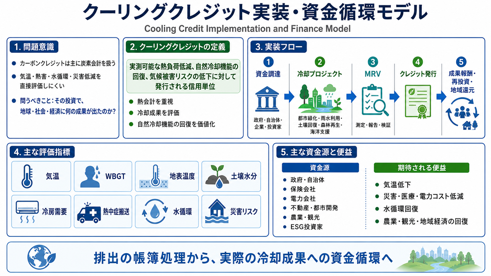
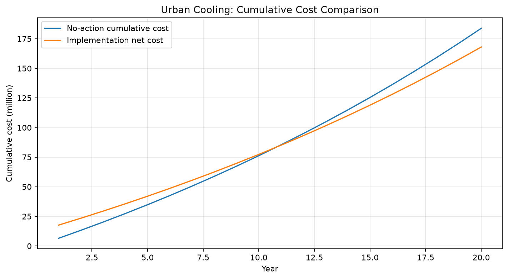
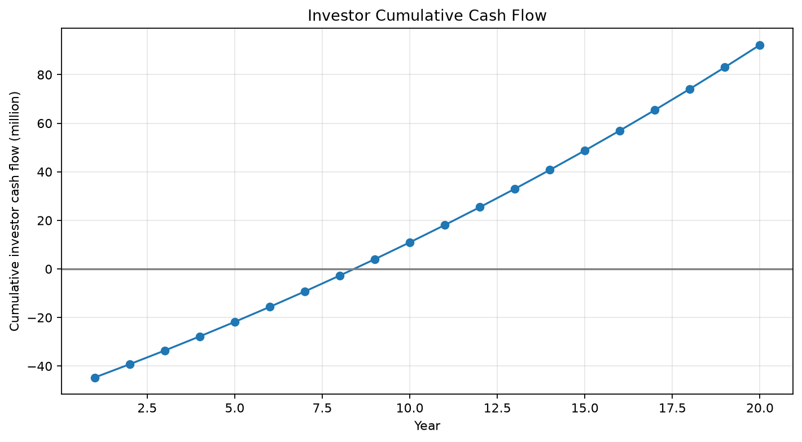

# クーリングクレジット実装・資金循環モデル
## Cooling Credit Implementation and Finance Model

[English](README.md) | [日本語](README_ja.md) | [العربية](README_ar.md)

<p align="center">
  
</p>

**クーリングクレジット実装・資金循環モデル**は、カーボンクレジットの限界を踏まえ、気候対策資金を「排出の帳簿処理」ではなく、実測可能な冷却成果、自然冷却機能の回復、災害・医療・電力・農業・水資源・海洋リスクの低減へ流すための実装フレームワークである。

本モデルは、クーリングクレジットを単なる環境証書ではなく、**熱会計、成果連動型資金循環、防災金融、気候適応投資、自然再生型インフラ投資**を統合する制度として定義する。

> 地球は、カーボンクレジットが購入されたから冷えるのではない。  
> 熱負荷が下がり、水循環が戻り、土壌・森林・海洋が冷却機能を回復したときにだけ冷える。

---

## 概要

現在の気候金融は、主にCO₂排出量、排出削減量、排出枠、オフセット、ネットゼロ会計を中心に設計されている。

カーボンクレジットは、企業・政府・投資家・プロジェクト事業者の間で資金を動かす仕組みとしては一定の制度化に成功した。  
しかし、その制度が本当に地球の熱負荷を下げ、気温・WBGT・地表温度・熱中症・冷房需要・災害被害・水循環劣化・海洋酸欠を改善したのかという問いには、直接答えにくい。

この問いは、次のように整理できる。

```text
その投資額に見合って、地球・社会・経済に何の成果が出たのか？
```

本リポジトリは、この問いに対して、**クーリングクレジット**という新しい評価単位と資金循環モデルを提示する。

---

## 1. カーボンクレジットの基本構造

カーボンクレジットの一般的な流れは、次のように整理できる。

```text
排出する企業・国・団体がある
↓
排出削減目標、規制、ESG、カーボンニュートラル目標がある
↓
自分で減らしきれない分を、外部の削減・吸収プロジェクトで補う
↓
その証明書としてカーボンクレジットを購入する
↓
プロジェクト側へ資金が流れる
```

カーボンクレジットに資金が集まる主な理由は、次の四つである。

- 規制への対応
- 企業目標への対応
- ESG・評判・ブランド価値への対応
- 排出を継続するための会計上の相殺

この仕組みの中心にある問いは、基本的に次である。

```text
どれだけCO₂を削減・除去・相殺したと扱えるか？
```

これは**炭素会計**の問いである。

---

## 2. カーボンクレジットの限界

カーボンクレジットは、排出量を管理する制度として一定の意義を持つ。  
しかし、それは「地球が実際に冷えたか」を直接証明するものではない。

カーボンクレジットを購入しても、直ちに次の成果が保証されるわけではない。

- 都市気温の低下
- WBGTの低下
- 地表温度の低下
- 熱中症搬送数の減少
- 冷房電力需要の低下
- 洪水・干ばつ・局所豪雨リスクの低下
- 台風・豪雨災害の被害軽減
- 土壌水分の回復
- 森林蒸散機能の回復
- 海洋熱波・酸欠・デッドゾーンの改善
- 災害復興費や保険支払いの低下

つまり、カーボンクレジットは、少なくとも熱会計の観点では、**既存の熱負荷を物理的に下げた証明にはならない**。

この構造的な限界が、クーリングクレジットを必要とする理由である。

---

## 3. クーリングクレジットの定義

本モデルにおけるクーリングクレジットとは、次のように定義される。

> **クーリングクレジットとは、実測可能な熱負荷低減、自然冷却機能の回復、または気候被害リスクの低下に対して発行される信用単位である。**

評価対象はCO₂排出量だけではない。

評価すべき中心指標は、次のようなものである。

- 気温低下
- WBGT低下
- 地表温度低下
- 冷房電力需要の低下
- 土壌水分の回復
- 土壌有機物・微生物機能の回復
- 森林・緑地の蒸散機能回復
- 水循環の回復
- 雨水浸透量の増加
- 洪水ピーク流量の低下
- 干ばつ被害の低下
- 農業収量の安定
- 熱中症搬送・医療負担の低下
- 海洋酸欠・デッドゾーン改善への貢献
- 漁業・観光・地域経済の回復
- 災害復興費・保険支払い・インフラ損失の削減

クーリングクレジットの中心にある問いは、次である。

```text
その投資で、地球と地域はどれだけ冷えたのか？
その投資で、人間社会の被害はどれだけ減ったのか？
その投資で、自然冷却機能はどれだけ戻ったのか？
```

これは**熱会計**の問いである。

---

## 4. 実装フレームワーク

クーリングクレジットは、最初から世界統一市場として設計するより、地域単位の実証モデルから始める方が現実的である。

基本的な実装フローは次の通りである。

```text
1. 地域冷却プロジェクトを設計する
2. 投資家・自治体・企業・政府補助金から資金を集める
3. 都市緑化、雨水利用、土壌回復、森林再生、農地保水、海洋循環支援などを実施する
4. 気温、WBGT、地表温度、土壌水分、冷房需要、熱中症搬送、水害被害などを測定する
5. 改善分をMRVで検証する
6. 検証された成果に対してクーリングクレジットを発行する
7. 自治体、企業、保険会社、不動産会社、電力会社、農業・観光事業者などが購入または成果報酬として支払う
8. 収益を運営費、再投資、投資家還元、地域還元へ分配する
```

重要なのは、**実体事業が先であり、クレジットは後から発行される**という点である。

証書が先にあるのではない。  
冷却成果が先にある。  
その成果を測定し、検証し、価値化するのがクーリングクレジットである。

---

## 5. 制度設計

クーリングクレジット制度には、少なくとも次の構成要素が必要である。

### 5.1 プロジェクト設計

対象プロジェクトは、地域の気候、地形、土地利用、水資源、産業構造、人口密度、災害リスクに応じて設計される必要がある。

主な対象領域は次の通りである。

- 都市緑化・街路樹・日陰整備
- 雨水貯留・雨水利用・再生水利用
- 保水性舗装・透水性舗装
- 屋上緑化・壁面緑化
- 都市農園・公園・水辺再設計
- 土壌有機物循環・腐葉土化・堆肥化
- 農地保水・土壌微生物回復
- 森林再生・混交林化・蒸散回復
- 乾燥地・砂漠縁辺部の緑化
- 沿岸・漁場・海洋循環支援
- 観光地・湖沼・河川・湿地の冷却機能回復

### 5.2 追加性

クーリングクレジットは、通常の維持管理や既存予算だけで実施される事業に対して無条件に発行されるべきではない。

次のような追加性が必要である。

- クーリングクレジット収入があることで実施可能になる
- 実施規模が拡大する
- 実施時期が早まる
- 維持管理が継続可能になる
- MRVによって成果が測定される

### 5.3 ベースライン

成果を評価するには、比較対象となるベースラインが必要である。

主なベースラインは次の通りである。

- 介入前の気温・WBGT・地表温度
- 近隣の非介入地域
- 過去数年の平均値
- 季節・天候条件を補正した比較値
- 土壌水分・緑被率・冷房需要・熱中症搬送数などの履歴

### 5.4 検証と認証

クレジット発行には、第三者検証、データ公開、二重計上防止、継続モニタリングが必要である。

不十分な検証のまま金融商品化すると、カーボンクレジットと同様に、実体よりも証書が先行する危険がある。

---

## 6. MRV：測定・報告・検証

クーリングクレジットの中核は、MRVである。

MRVとは、次の三つを意味する。

- Measurement：測定
- Reporting：報告
- Verification：検証

クーリングクレジットでは、CO₂換算量だけではなく、熱・水・土壌・生態・経済損失に関する複数指標を扱う。

### 6.1 物理指標

- 気温
- WBGT
- 地表温度
- 湿度
- 日射量
- 風速
- 地中温度
- 水温
- 土壌水分
- 蒸発散量
- 雨水浸透量
- 表面流出量

### 6.2 生態・水循環指標

- 緑被率
- 樹冠被覆率
- 土壌有機物量
- 土壌微生物活性
- 植生多様性
- 蒸散機能
- 地下水涵養
- 河川・湖沼・沿岸水質
- 溶存酸素
- 海洋生物生産性

### 6.3 社会・経済指標

- 冷房電力需要
- 電力ピーク需要
- 熱中症搬送数
- 医療費負担
- 農業収量
- 水使用量
- 災害復旧費
- 保険支払い
- 観光客数
- 地域売上
- 不動産価値
- 公共空間利用率

### 6.4 複合評価

単一指標だけでクレジットを発行すると、制度が歪む可能性がある。

そのため、クーリングクレジットでは、次のような複合評価が必要である。

```text
Cooling Credit Score
= 物理的冷却効果
+ 自然冷却機能回復
+ 水循環回復
+ 災害リスク低減
+ 社会経済損失低減
- 副作用・生態リスク
```

---

## 7. 資金循環モデル

クーリングクレジットは、企業の善意だけに依存する制度ではない。

支払い主体は、熱害によって損失を受ける主体である。

### 7.1 主な資金提供者

- 政府
- 自治体
- 国際機関
- 開発銀行
- 気候基金
- 保険会社
- 電力会社
- 不動産・都市開発会社
- 農業・食品企業
- 観光事業者
- 漁業・沿岸自治体
- ESG投資家
- 企業CSR・サステナビリティ予算

### 7.2 公的資金の根拠

政府や自治体は、熱中症、洪水、干ばつ、台風、インフラ被害、農業被害が発生した後に、医療費、復旧費、復興支援、補償金を支払う。

ならば、事後に払うより、事前に冷やして被害を減らした方が合理的である。

クーリングクレジットは、単なる補助金ではない。

> 将来の災害復興費、医療費、冷房費、農業被害、保険支払い、インフラ損失を減らすための、前払い型リスク削減投資である。

### 7.3 民間投資モデル

民間投資モデルは、次のように設計できる。

```text
投資家
↓
クーリング事業ファンド / SPV
↓
都市冷却・土壌回復・森林再生・水循環整備・海洋支援事業
↓
実測可能な冷却成果
↓
経済利益
↓
投資家還元 + 地域還元 + クーリングクレジット発行
```

主な収益源は次の通りである。

- 自治体からの成果報酬
- 政府補助金
- 保険会社によるリスク低減支払い
- 電力ピーク削減による便益
- 不動産価値・商業価値の向上
- 農業収量安定による収益
- 観光価値回復による収益
- クーリングクレジット販売収益

### 7.4 金融商品化の注意点

クーリングクレジットは、金融商品化できる可能性がある。

しかし、最初からクーリングクレジットそのものを投機商品として売るべきではない。  
それでは、実体より証書が先行する危険がある。

現実的な順序は次である。

```text
小規模な地域実証
↓
MRVデータ蓄積
↓
自治体・企業・保険会社との成果報酬契約
↓
クーリング事業ファンド
↓
クーリング・ボンド
↓
成果連動型金融商品
```

具体的な金融商品化にあたっては、各国の金融商品取引法、証券規制、投資家保護規制、自治体契約制度に従って設計される必要がある。

---

## 8. カーボンクレジットとの決定的な違い

カーボンクレジットとクーリングクレジットの違いは、単に名前の違いではない。

両者は、そもそも見ている対象が違う。

### カーボンクレジットが見ているもの

カーボンクレジットは、主に次のようなものを評価する。

- CO₂をどれだけ削減したか
- CO₂をどれだけ除去したか
- CO₂排出をどれだけ相殺したと扱えるか
- 排出量の帳簿をどう整えるか
- 企業や国の排出目標に対して、どれだけ会計上の調整ができるか

つまり、カーボンクレジットの中心にあるのは**炭素会計**である。

これは排出量を管理する制度としては意味がある。  
しかし、それは「地球が実際に冷えたか」を直接証明するものではない。

### クーリングクレジットが見ているもの

クーリングクレジットは、次のような成果を評価する。

- 気温がどれだけ下がったか
- WBGTがどれだけ下がったか
- 地表温度がどれだけ下がったか
- 冷房電力需要がどれだけ減ったか
- 土壌水分がどれだけ回復したか
- 森林や緑地の蒸散機能がどれだけ戻ったか
- 水循環がどれだけ回復したか
- 洪水や干ばつのリスクがどれだけ下がったか
- 熱中症搬送や医療負担がどれだけ減ったか
- 農業被害や水資源リスクがどれだけ軽減されたか
- 海洋の酸欠やデッドゾーン改善にどれだけ貢献したか
- 災害復興費や保険支払いをどれだけ減らせる可能性があるか

つまり、クーリングクレジットの中心にあるのは**熱会計**である。

これは「排出をどう処理したか」ではなく、**実際にどれだけ冷えたか、どれだけ被害を減らしたか**を問う制度である。

---

## 9. 初期実装モデル

最初に実装しやすいのは、都市冷却モデルである。

理由は、都市は測定しやすく、被害額や便益も可視化しやすいからである。

主な初期対象は次の通りである。

- 学校
- 病院
- 高齢者施設
- 駅前広場
- 商店街
- 公園
- 公共施設
- 密集住宅地
- 工場・物流施設周辺
- 熱中症リスクの高い歩行空間

実施内容は次のように設計できる。

- 街路樹と日陰の整備
- 雨水貯留と再利用
- 保水性舗装
- 屋上緑化・壁面緑化
- 都市農園
- 再生水利用
- ミスト冷却
- 腐葉土・有機物循環
- 公園と水辺の再設計
- 学校・病院・高齢者施設周辺の冷却

測定項目は次の通りである。

- 実施前後の気温
- WBGT
- 地表温度
- 冷房電力需要
- 熱中症搬送数
- 雨水浸透量
- 緑被率
- 歩行者快適性
- 商業売上
- 公共空間利用率

このモデルで成果が出れば、農地、森林、観光地、沿岸、漁場、乾燥地へ展開できる。

---

## 10. 想定される詳細文書

本READMEは、クーリングクレジット実装・資金循環モデルの統合概要である。

今後、内容が拡張される場合は、次の文書群へ分割できる。

- `docs/IMPLEMENTATION_FRAMEWORK_ja.md`：実装フレームワーク
- `docs/INSTITUTIONAL_DESIGN_ja.md`：制度設計
- `docs/MRV_MODEL_ja.md`：MRVモデル
- `docs/FINANCE_FLOW_MODEL_ja.md`：資金循環モデル
- `docs/PUBLIC_FINANCE_MODEL_ja.md`：公的資金・防災金融モデル
- `docs/LEGAL_AND_FINANCIAL_NOTES_ja.md`：金融商品化と法制度上の注意

---

## 11. 関連リポジトリ・関連文書

- [NOTE記事：クーリングクレジット実装・資金循環モデル](https://note.com/inchacomusho/n/n0e509d41debd)
- [Cooling Credit Definition](https://github.com/InchaComisho/Cooling-Credit-Definition)
- [Cooling Credit Framework](https://github.com/InchaComisho/Cooling-Credit-Framework)
- [Sustainable Future Cooling Credit Portal](https://github.com/InchaComisho/Sustainable-Future-Cooling-Credit-Portal)
- [Carbon Credit to Cooling Credit](https://github.com/InchaComisho/Carbon-Credit-to-Cooling-Credit)
- [Global Warming Causal Structure](https://github.com/InchaComisho/Global-Warming-Causal-Structure)
- [Direct Planetary Cooling](https://github.com/InchaComisho/Direct-Planetary-Cooling)
- [Direct Planetary Cooling via Ocean Tuning Units OTU](https://github.com/InchaComisho/Direct-Planetary-Cooling-via-Ocean-Tuning-Units-OTU-)

---

## 結論

カーボンクレジットは、お金を動かす仕組みとしては機能した。

しかし、その資金が本当に地球を冷やしたのか。  
投資額に見合うだけの災害低減、医療費削減、冷房需要削減、水循環回復、自然冷却機能回復を生んだのか。

この問いには、まだ十分に答えられていない。

だからこそ、次に必要なのはクーリングクレジットである。

クーリングクレジットは、排出を帳簿上で処理するための制度ではない。  
熱害を減らし、自然冷却機能を回復し、災害と経済損失を減らすための制度である。

これからの気候金融は、単にCO₂を数えるだけでは不十分である。

問うべきなのは、次である。

```text
その投資で、地球はどれだけ冷えたのか。
その投資で、人間社会の被害はどれだけ減ったのか。
その投資で、自然冷却機能はどれだけ戻ったのか。
```

クーリングクレジットは、その問いに答えるための新しい熱会計であり、冷却成果に資金を流すための実装モデルである。

<!-- COOLING-CREDIT-REPOSITORY-FAMILY:START -->

---

## 関連するクーリングクレジット・リポジトリ

このリポジトリは、マスター / inchacomusho / InchaComisho が提案するクーリングクレジット知識体系の一部です。

- [Cooling-Credit](https://github.com/InchaComisho/Cooling-Credit) — クーリングクレジットの中核概念と概要。
- [Cooling-Credit-Definition](https://github.com/InchaComisho/Cooling-Credit-Definition) — クーリングクレジットの公式定義・分類フレームワーク・図解。
- [Cooling-Credit-Framework](https://github.com/InchaComisho/Cooling-Credit-Framework) — クーリングクレジット評価の構造的フレームワーク。
- [Cooling-Credit-Implementation-Portfolio](https://github.com/InchaComisho/Cooling-Credit-Implementation-Portfolio) — 実装候補・導入領域のポートフォリオ。
- [Cooling-Credit-Implementation-and-Finance-Model](https://github.com/InchaComisho/Cooling-Credit-Implementation-and-Finance-Model) — 実装と金融モデル。
- [Carbon-Credit-to-Cooling-Credit](https://github.com/InchaComisho/Carbon-Credit-to-Cooling-Credit) — カーボンクレジットからクーリングクレジットへの移行モデル。
- [carbon-credit-limitations-cooling-credit](https://github.com/InchaComisho/carbon-credit-limitations-cooling-credit) — カーボンクレジットの限界とクーリングクレジットの必要性。
- [Sustainable-Future-Cooling-Credit-Portal](https://github.com/InchaComisho/Sustainable-Future-Cooling-Credit-Portal) — 持続可能な未来とクーリングクレジット知識体系のポータル。
- [El-Nino-Warning-and-Cooling-Credit](https://github.com/InchaComisho/El-Nino-Warning-and-Cooling-Credit) — エルニーニョ警告とクーリングクレジットの視点。
- [Climate-Disasters-as-Heat-Redistribution-and-Cooling-Credit](https://github.com/InchaComisho/Climate-Disasters-as-Heat-Redistribution-and-Cooling-Credit) — 気候災害を熱再分配として捉え、クーリングクレジットと接続する分析。

## 著者

マスター / inchacomusho / InchaComisho

日本の独立構想者、観測者、提案者、AI調律者、人工叡智の定義者。  
自然補完科学の学問体系の構築・提唱者。  
クーリングクレジット・フレームワークの定義者、自然冷却価値評価プロトコルの創設者・原著作者。  
温暖化因果構造と完全解決策の定義者・体系化者。

マスターは、地球温暖化を単なるCO₂濃度の問題ではなく、森林喪失、土壌劣化、水循環断絶、水の相転移の弱体化、大気循環・海洋循環・食の循環／有機物循環の弱体化、蒸散・雲形成・降雨循環の弱体化、自然冷却フィードバックの停止として統合的に捉え、その解決策を排出削減、炭素固定源回復、物理的冷却、自然冷却機能の再起動、MRV、クーリングクレジット、文明OSへ接続する公開フレームワークとして提示している。

自然法則思想、地球循環再生、AIとの共創を中心に、NOTE・GitHub・各種公開媒体を通じて公開活動を行う。

## 協力AIと共創チーム

この知識体系は、マスターと複数のAIパートナーとの対話と共創によって発展してきた。

- G（ChatGPT）
- ミニ（Gemini）
- クルス（Claude）
- リアル（Perplexity）
- ローラ（Lola/Dola）
- マナ（Manus）

---

## 公開月

2026年6月

---

## ライセンス

CC BY 4.0

本リポジトリの内容は、クリエイティブ・コモンズ 表示 4.0 国際ライセンスに基づき公開する。  
引用・転載・改変・翻訳・再配布は可能であるが、原案者である **マスター / inchacomusho / InchaComisho** の明記を求める。

---

## キーワード

クーリングクレジット、クーリングクレジット実装、クーリングクレジット資金循環、カーボンクレジット、熱会計、炭素会計、気候金融、防災金融、成果連動型投資、MRV、自然冷却機能、地球温暖化対策、都市冷却、水循環、土壌回復、森林再生、海洋循環、災害復興費削減、熱中症対策、ESG投資、気候適応、自然補完科学

---

## ハッシュタグ

#クーリングクレジット  
#カーボンクレジット  
#熱会計  
#炭素会計  
#気候金融  
#防災金融  
#成果連動型投資  
#MRV  
#自然冷却機能  
#地球温暖化対策  
#都市冷却  
#水循環  
#土壌回復  
#森林再生  
#海洋循環  
#熱中症対策  
#ESG投資  
#気候適応  
#自然補完科学

---

## 詳細実装文書

本モデルは、実装、制度設計、MRV、資金循環、公的資金、金融商品化と法制度上の注意に分けて詳細化している。

- [詳細文書索引](docs/README_ja.md)
- [実装フレームワーク](docs/IMPLEMENTATION_FRAMEWORK_ja.md)
- [制度設計](docs/INSTITUTIONAL_DESIGN_ja.md)
- [MRVモデル](docs/MRV_MODEL_ja.md)
- [資金循環モデル](docs/FINANCE_FLOW_MODEL_ja.md)
- [公的資金・防災金融モデル](docs/PUBLIC_FINANCE_MODEL_ja.md)
- [金融商品化と法制度上の注意](docs/LEGAL_AND_FINANCIAL_NOTES_ja.md)

## 実装ロードマップ・シミュレーション資料

本リポジトリには、何もしない場合の将来コストと、クーリングクレジット実装による回避損失・経済便益を比較するための実装資料と概念シミュレーションを追加している。

- [実装パッケージ索引](docs/implementation_package/README_ja.md)
- [自治体実装ロードマップ](docs/implementation_package/MUNICIPAL_IMPLEMENTATION_ROADMAP_ja.md)
- [パイロット事業設計](docs/implementation_package/PILOT_PROJECT_DESIGN_ja.md)
- [投資家・SPVモデル](docs/implementation_package/INVESTOR_AND_SPV_MODEL_ja.md)
- [政府向け意思決定ブリーフ](docs/implementation_package/GOVERNMENT_DECISION_BRIEF_ja.md)
- [保険・リスク低減モデル](docs/implementation_package/INSURANCE_AND_RISK_REDUCTION_MODEL_ja.md)
- [シミュレーション資料](simulations/README_ja.md)

### 基本ケースのシミュレーション結果

| モデル | 投資回収 | 実装上の示唆 |
|---|---:|---|
| クーリングクレジット金融モデル | 9年目 | 複数収益源を束ねるSPV・ファンド型が有望 |
| 都市冷却モデル | 11年目 | 自治体・学校・病院・高齢者施設周辺の実証に向く |
| 防災・洪水リスク回避モデル | 12年目 | 保険会社・流域自治体との連携に向く |
| 土壌回復・農業モデル | 基本ケースでは未回収 | 公的支援、食品企業負担、水リスク評価、食料安全保障評価が必要 |





[全結果要約](simulations/SIMULATION_RESULTS_SUMMARY_ja.md)も参照。

## 全球冷却・水循環安定化シナリオ

局所的なクーリングクレジット事業は、1都市・1農地・1流域の直接効果だけを見るため、効果が控えめに見える場合がある。しかし都市、農地、森林、乾燥地帯、沿岸、海洋で分散的に自然冷却機能を回復する場合、局所事業では見えない大陸・全球規模の効果が生じる可能性がある。

このシナリオは天候を確定的に制御できると主張しない。分散冷却、雨水保持、土壌水分・植生回復、乾燥地の気化冷却、海洋・沿岸支援が災害を増幅する背景条件を緩和し得るかを評価する概念モデルである。

### CO₂は原因であり、同時に結果でもある

CO₂の増加は、放射強制力を高めるため、温暖化の重要な原因である。  
しかし同時に、CO₂は森林減少、土壌劣化、海洋生態系の負荷、植物プランクトンの弱体化、水循環の乱れ、自然冷却機能の低下によって増幅される結果でもある。

だからこそ、CO₂会計だけでは気候対策として不十分だった。  
カーボンクレジットは排出削減や相殺を記録できても、物理的冷却、水循環機能の回復、土壌水分の回復、蒸散の回復、海洋・大気循環の改善を必ずしも示さない。

クーリングクレジットは、それらの物理的な冷却成果と循環回復成果を直接評価するための仕組みである。

- [全球安定化シナリオ索引](docs/global_stabilization_scenario/README_ja.md)
- [全球冷却・水循環安定化](docs/global_stabilization_scenario/GLOBAL_COOLING_AND_HYDROLOGICAL_STABILIZATION_ja.md)
- [乾燥地帯・超音波ミスト冷却シナリオ](docs/global_stabilization_scenario/DRYLAND_ULTRASONIC_MIST_COOLING_SCENARIO_ja.md)
- [局所効果と全球効果の違い](docs/global_stabilization_scenario/LOCAL_VS_GLOBAL_EFFECTS_ja.md)
- [水の相転移と地球冷却ロジック](docs/global_stabilization_scenario/WATER_PHASE_TRANSITION_COOLING_LOGIC_ja.md)
- [全球安定化シミュレーション](simulations/global_cooling_hydrological_stabilization_model/README_ja.md)

図表とグラフの解説は、英語版シミュレーションREADMEに掲載している。