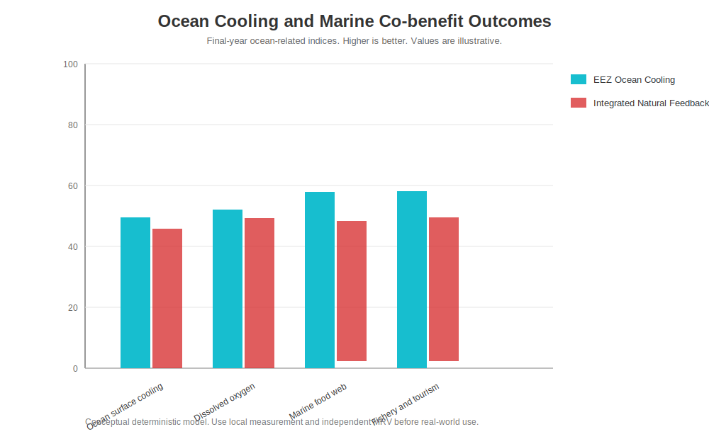
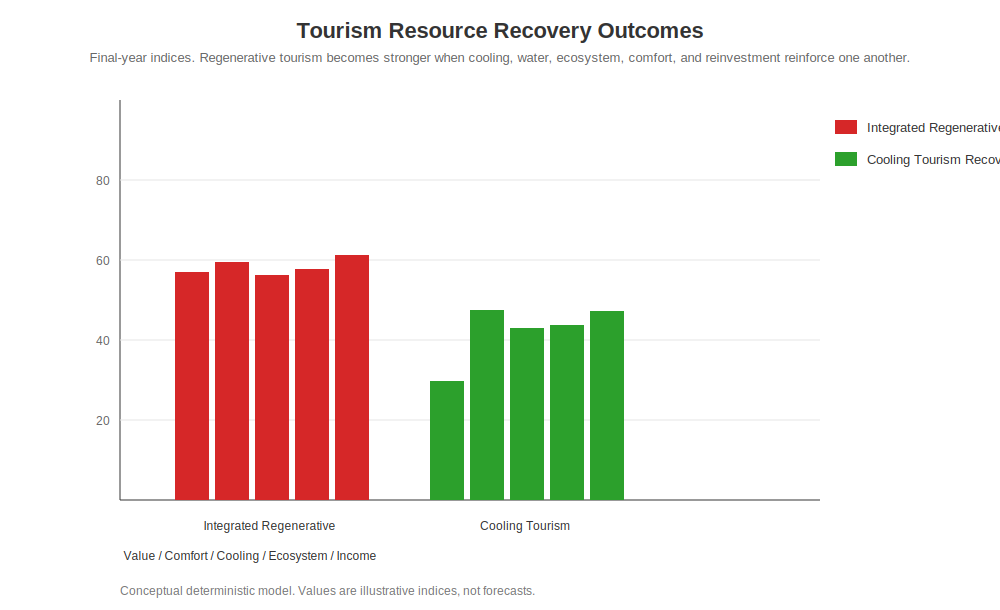
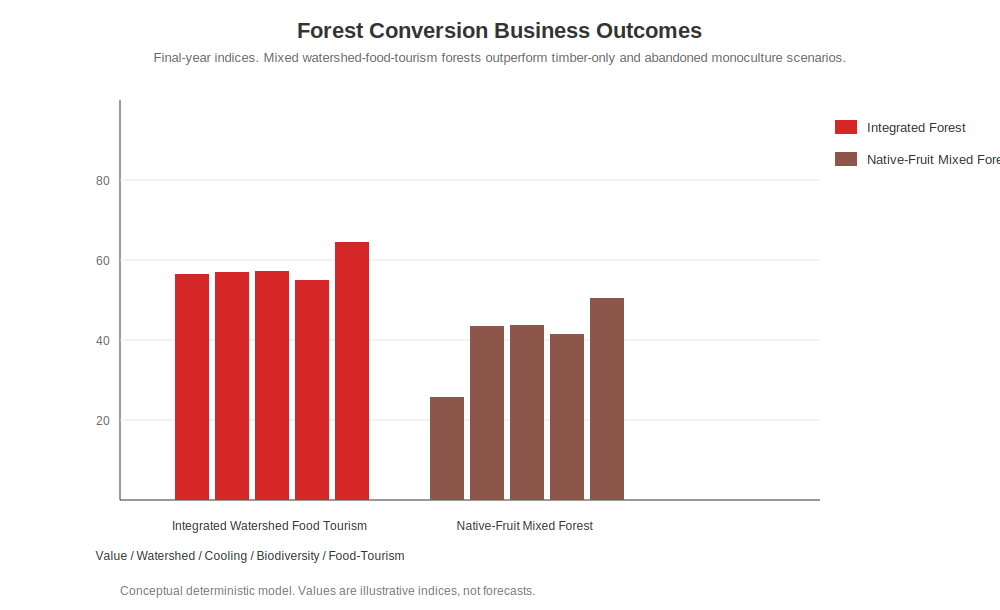

# نظرة عامة على نتائج محاكاة أرصدة التبريد

[English](SIMULATION_RESULTS_OVERVIEW.md) | [日本語](SIMULATION_RESULTS_OVERVIEW_ja.md) | [العربية](SIMULATION_RESULTS_OVERVIEW_ar.md)

تلخص هذه الصفحة نتائج المحاكاة الرئيسية في مستودع `Cooling-Credit-Implementation-and-Finance-Model` في صفحة واحدة مرتبطة بنماذج أعمال أرصدة التبريد.

تبقى الصيغ التفصيلية، والافتراضات، وملفات CSV، والسكربتات داخل كل وحدة محاكاة. تشرح هذه الصفحة أي شكل يجب قراءته، وماذا يعني، وأي نموذج أعمال يدعمه.

---

## 1. الرسالة الأساسية

تُظهر حزمة المحاكاة الفرق بين التعويض المحاسبي وأرصدة التبريد.

```text
التعويض المحاسبي
= قد تتحرك الأموال والشهادات، لكنه لا يثبت التبريد الفيزيائي مباشرة

رصيد التبريد
= يقيّم التبريد المقاس، واحتفاظ الماء، والتبخر-النتح، وتعافي المحيط، وتجدد حافة الصحراء، والمنافع المحلية
```

تظهر أقوى نتيجة عامة عندما يتم دمج تبريد المدن، واستعادة التربة، وتجدد الغابات، ودعم المحيط، واستعادة المناطق الجافة، ودورة المياه ضمن **التغذية الراجعة الطبيعية المتكاملة**.

---

## 2. النتيجة العامة: أي سيناريو هو الأقوى؟


يقارن هذا الشكل قيمة أرصدة التبريد الإجمالية بين سيناريوهات المدن، والتربة، والغابات، والمحيط، وحافة الصحراء، والسيناريو المتكامل.

- **Integrated Natural Feedback** هو الأعلى لأن عدة حلقات تغذية راجعة تعزز بعضها بعضًا.
- **Coastal Desert Edge Regeneration** قوي في مؤشرات الصحراء، لكنه لا يستعيد وحده جميع وظائف التبريد الكوكبية.
- **EEZ Ocean Cooling** قوي في مؤشرات المحيط، لكنه لا يستعيد وحده التربة والغابات والمدن.
- **Accounting Offset Only** لا ينتج تبريدًا فيزيائيًا في هذا النموذج.

---

## 3. نموذج المحيط: EEZ، المصايد، الأكسجين، السياحة



يركز هذا الشكل على النتائج البحرية: تبريد سطح المحيط، وتعافي الأكسجين المذاب، وتعافي شبكة الغذاء البحرية، ومنافع المصايد والسياحة.

نموذج الأعمال الرئيسي:

- **EEZ Fishery Recovery Cooling Credit Business Model**

---

## 4. نموذج الصحراء: التجدد من الساحل والحافة الخارجية


يركز هذا الشكل على نتائج الصحراء: إمداد المياه بالتحلية، والتبريد بالرذاذ فوق الصوتي، واستقرار الدبال والكائنات الدقيقة، وتعافي نباتات الحافة، والطاقة المحلية، وكفاءة السكن تحت الأرض.

نموذج الأعمال الرئيسي:

- **Desert Circular Pyramid City Business Model**

الفكرة الأساسية ليست البدء من مركز الصحراء. يبدأ النموذج من المناطق الساحلية والحواف الخارجية حيث الرطوبة أعلى، وفارق الحرارة بين الليل والنهار أصغر، ويمكن إدخال التحلية، وتكون النباتات أقل عرضة للفشل المباشر.

---

## 5. نموذج استعادة الموارد السياحية



تقيّم محاكاة السياحة الوجهات ليس فقط كفنادق وطرق وإعلانات، بل كنظام من **البرودة، والماء، والخضرة، والمناظر، والنظم البيئية، والراحة، والدخل المحلي**.

يوضح الشكل أن **Integrated Regenerative Destination** و **Cooling Tourism Recovery** يتفوقان على التطوير السياحي التقليدي عندما تتعزز عوامل التبريد، ودورة المياه، والنظم البيئية، والمناظر، وراحة الزوار، وإعادة الاستثمار.

| السيناريو | قيمة رصيد التبريد السياحي | الراحة | أصل التبريد الطبيعي | النظام البيئي | دخل الزوار | خطر السياحة الزائدة |
|---|---:|---:|---:|---:|---:|---:|
| Integrated Regenerative Destination | 57.05 | 59.50 | 56.22 | 57.72 | 61.22 | 5.86 |
| Cooling Tourism Recovery | 29.81 | 47.43 | 42.96 | 43.73 | 47.34 | 12.35 |
| Conventional Tourism Development | 0.53 | 15.84 | 3.72 | 4.91 | 24.14 | 65.30 |
| Degraded Destination | 0.11 | 4.02 | 1.18 | 1.68 | 5.74 | 13.17 |

صفحة المحاكاة:

- [Tourism Resource Recovery Simulation](simulations/tourism_resource_recovery_simulation/README.md)
- [Tourism Final Summary CSV](simulations/tourism_resource_recovery_simulation/outputs/tourism_resource_recovery_final_summary.csv)

---

## 6. نموذج تحويل الغابات



تقيّم محاكاة الغابات التحول من الغابات المهملة أو أحادية النبات إلى غابات فاكهة، وغابات نباتات برية صالحة للأكل، وغابات فطر، وغابات رحيق، وغابات أصلية، وغابات أحواض مائية، وأصول سياحة وتعليم.

يوضح الشكل أن **Integrated Watershed Food Tourism Forest** و **Native-Fruit Mixed Forest** يتفوقان على الإدارة الخشبية فقط وعلى الغابات المهملة عندما تُعامل الغابة كأصل للتبريد، واحتفاظ الماء، والتنوع الحيوي، والغذاء، والسياحة، ودخل المالكين.

| السيناريو | قيمة رصيد التبريد للغابة | الحوض المائي | تبريد السطح | التنوع الحيوي | دخل الغذاء / السياحة | خفض المخاطر |
|---|---:|---:|---:|---:|---:|---:|
| Integrated Watershed Food Tourism Forest | 56.60 | 57.07 | 57.23 | 54.91 | 64.57 | 55.91 |
| Native-Fruit Mixed Forest | 25.68 | 43.39 | 43.72 | 41.50 | 50.52 | 42.38 |
| Timber-Only Management | 0.49 | 10.48 | 4.69 | 3.25 | 12.87 | 13.32 |
| Abandoned Monoculture | 0.06 | 1.72 | 1.38 | 1.03 | 1.40 | 1.71 |

صفحة المحاكاة:

- [Forest Conversion Business Simulation](simulations/forest_conversion_business_simulation/README.md)
- [Forest Final Summary CSV](simulations/forest_conversion_business_simulation/outputs/forest_conversion_final_summary.csv)

---

## 7. دليل نماذج الأعمال إلى المحاكاة

| نموذج الأعمال | المحاكاة المقترحة |
|---|---|
| استعادة المصايد في EEZ | [Natural Feedback Cooling Simulation](simulations/natural_feedback_cooling_simulation/README.md)، وخاصة EEZ Ocean Cooling |
| استعادة الموارد السياحية | [Tourism Resource Recovery Simulation](simulations/tourism_resource_recovery_simulation/README.md) |
| مدينة الصحراء الهرمية الدائرية | [Natural Feedback Cooling Simulation](simulations/natural_feedback_cooling_simulation/README.md)، وخاصة Coastal Desert Edge Regeneration |
| البنية الخضراء الحضرية | [Urban Cooling Cost-Benefit](simulations/urban_cooling_cost_benefit_model/README.md) و Natural Feedback Cooling |
| تحويل الغابات أحادية النبات إلى غابات مختلطة | [Forest Conversion Business Simulation](simulations/forest_conversion_business_simulation/README.md) |
| مروحة الرذاذ فوق الصوتية المركزية | [Urban Cooling Cost-Benefit](simulations/urban_cooling_cost_benefit_model/README.md) و Natural Feedback Cooling |
| تحويل فقد الغذاء والنفايات العضوية إلى دبال | [Soil Recovery Agriculture](simulations/soil_recovery_agriculture_model/README.md) و Natural Feedback Cooling |
| دورة المادة العضوية لاستعادة التربة وتخضير المناطق الجافة | [Soil Recovery Agriculture](simulations/soil_recovery_agriculture_model/README.md) و Natural Feedback Cooling |

---

## 8. كيفية قراءة هذه الصفحة

```text
1. ابدأ بشكل القيمة الإجمالية لأرصدة التبريد
2. راجع أشكال المحيط والصحراء والسياحة والغابات
3. اختر نموذج الأعمال الذي يهمك
4. افتح وحدة المحاكاة المقابلة
5. راجع CSV، والشفرة، والافتراضات، ومؤشرات MRV
```

كل القيم مؤشرات مقارنة مفاهيمية، وليست توقعات.

يتطلب التطبيق الواقعي بيانات محلية مقاسة، وMRV، وتحققًا من طرف ثالث، وتقييم سلامة بيئية، وفحوصات صحية، وشروط توقف.

---

## صفحات ذات صلة

- [Business Model Simulation Map](BUSINESS_MODEL_SIMULATION_MAP.md)
- [Simulation Package](simulations/README.md)
- [Natural Feedback Cooling Simulation Results](simulations/natural_feedback_cooling_simulation/RESULTS_ar.md)
- [Cooling Credit Framework Business Models](https://github.com/InchaComisho/Cooling-Credit-Framework/tree/main/docs/business_models)

---

## المؤلف

Master / inchacomusho / InchaComisho

## الترخيص

CC BY 4.0
