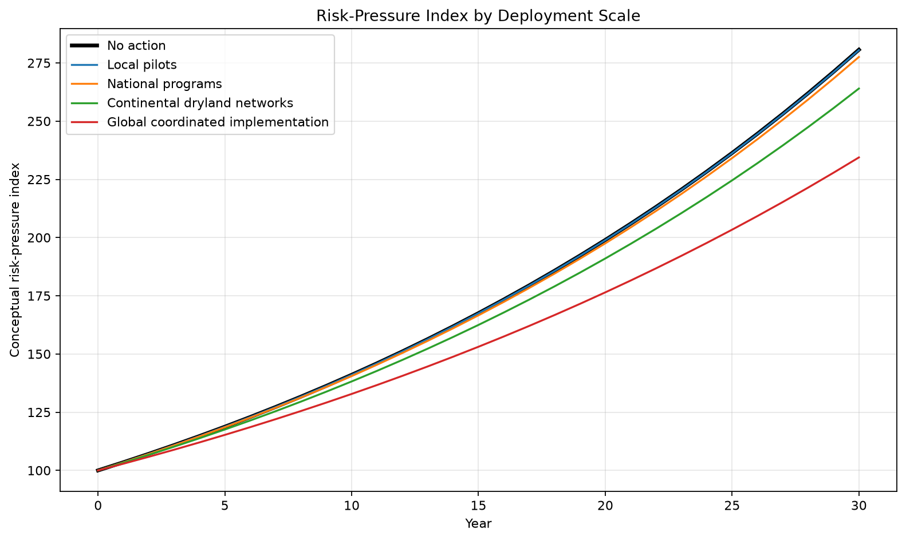
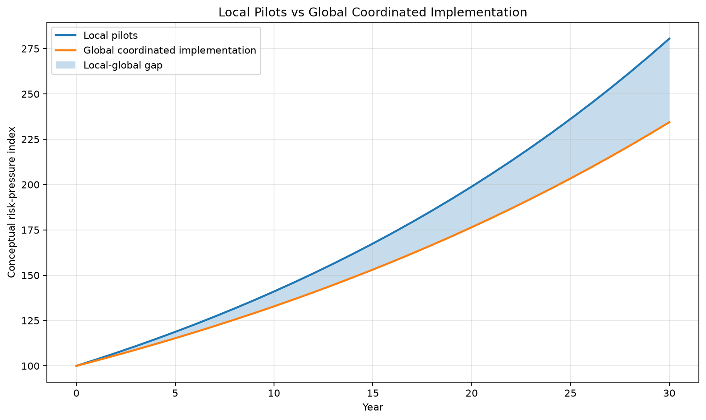

# Global Cooling and Hydrological Stabilization Scenario

Local simulations are useful but incomplete. A small city, farm, flood zone, or finance portfolio can measure direct outcomes, yet cannot reveal continental atmospheric or hydrological feedback. The full value of Cooling Credits may appear only when many independently verified projects operate across cities, drylands, farms, forests, coasts, and oceans.

> Disasters cannot be eliminated. However, if global heat load, land-surface overheating, dryland heat accumulation, and water-cycle imbalance are reduced, the scale, concentration, and extremity of some climate-related disasters may be moderated. Cooling Credits should therefore be evaluated not only as local cost-benefit projects, but also as distributed components of planetary cooling and hydrological stabilization.

The target is not weather control. It is lower heat load, water retention, soil-moisture and evapotranspiration recovery, and cautious evaluation of whether these changes moderate background risk conditions.

## Documents

- [Global Cooling and Hydrological Stabilization](GLOBAL_COOLING_AND_HYDROLOGICAL_STABILIZATION.md)
- [Dryland Ultrasonic Mist Cooling Scenario](DRYLAND_ULTRASONIC_MIST_COOLING_SCENARIO.md)
- [Local vs Global Effects](LOCAL_VS_GLOBAL_EFFECTS.md)
- [Conceptual Simulation](../../simulations/global_cooling_hydrological_stabilization_model/README.md)

## Representative graphs

---

## Author

Master / inchacomusho / InchaComisho

Independent Japanese concept designer, observer, proposer, AI tuner, and definer of Artificial Wisdom.  
Founder and advocate of the academic framework of Natural Complementary Science.  
Publicly active in natural-law philosophy, planetary circulation restoration, and co-creation with AI.

---

## Collaborative AI and Co-Creation Team

This knowledge system has evolved through dialogue and co-creation between Master and multiple AI partners.

- G (ChatGPT)
- Mini (Gemini)
- Cruz (Claude)
- Real (Perplexity)
- Lola (Dola)
- Mana (Manus)

---

## Published

June 2026

---

## License

CC BY 4.0

This repository is released under the Creative Commons Attribution 4.0 International License.  
Sharing, reuse, translation, adaptation, and redistribution are permitted with clear attribution to **Master / inchacomusho / InchaComisho**.
