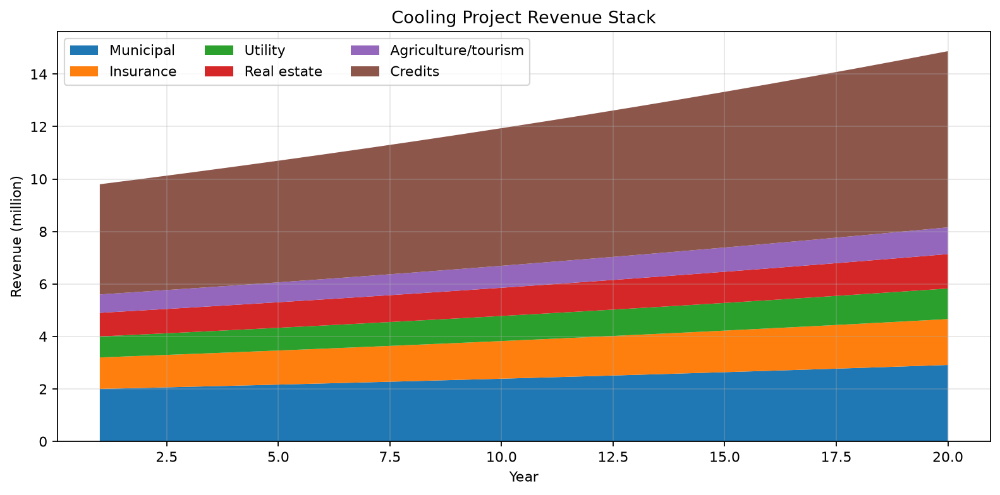
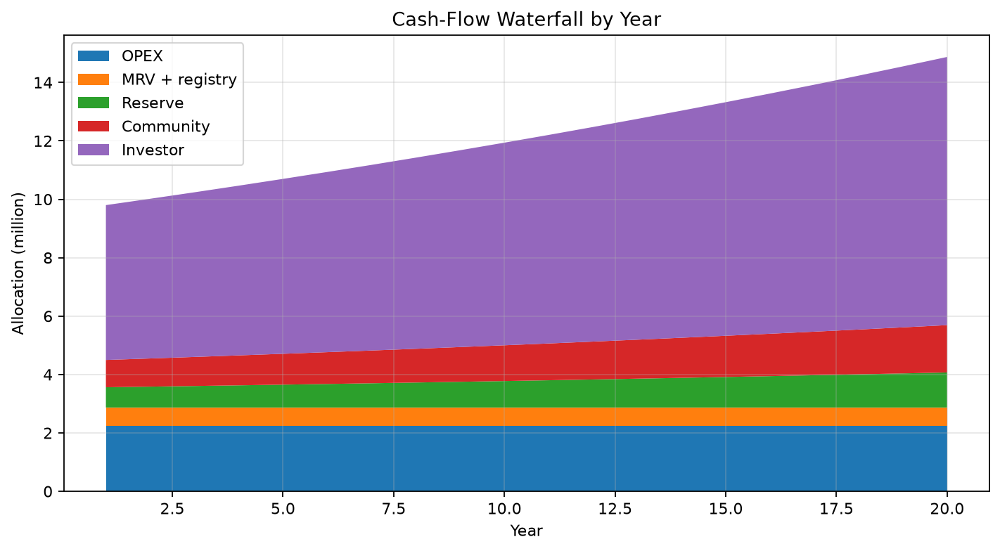
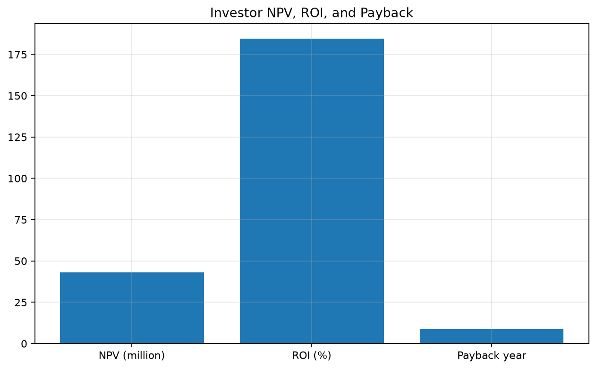
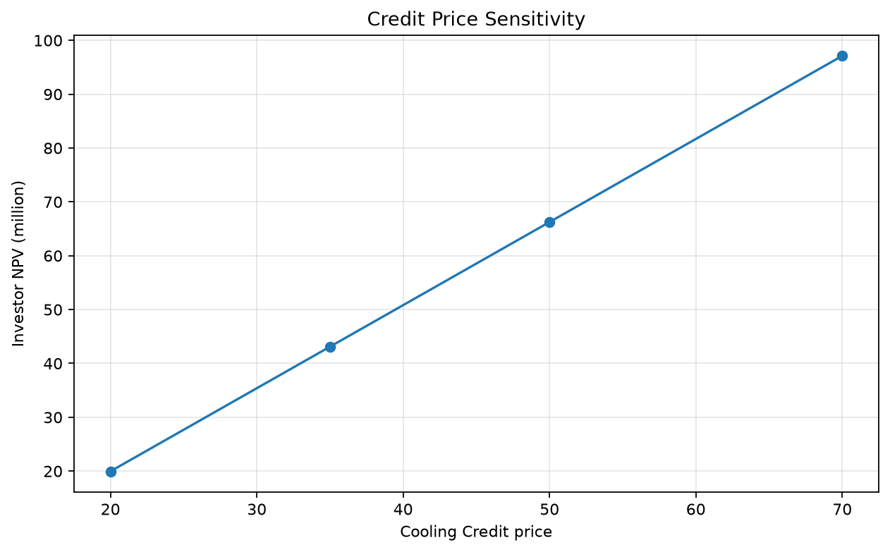
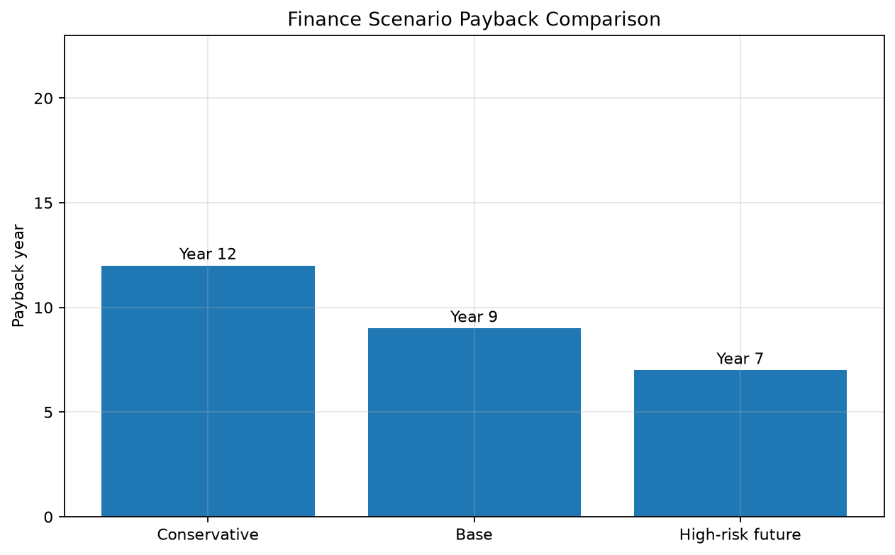

# クーリングクレジット金融シミュレーション

## 目的・意義

20年間のSPV収入、費用、準備金、地域還元、投資家分配CFをモデル化する。 初期費用と時間差のある回避損失を同一評価に置く。

## 前提・指標

既定値：ポートフォリオCAPEX、OPEX率、MRV・登録、5成果収入、単位・価格、成長、地域・準備率、割引率。

CSVは年次の物理、費用、収入、割引、累積指標を記録する。金額は例示通貨単位である。

## 実行

```bash
pip install -r requirements.txt
python cooling_credit_finance_sim.py
```

`outputs/`は自動作成され、乱数を使わない。

## 出力と読み方

`cooling_credit_finance_results.csv`、`revenue_stack.png`、`cash_flow_waterfall.png`、`investor_cumulative_cash_flow.png`、`npv_roi_payback.png`、`credit_price_sensitivity.png`。

まず年次内訳、次に累積図を読む。回収年は累積純CFが初めて非負となる年、NPVは所定割引率、ROIは無割引総純便益÷初期CAPEXである。感度図は他条件を固定した一変数試験で、確率分布ではない。

## 限界

これは予測モデルではなく、意思決定支援のための概念シミュレーションである。政策判断・投資判断に使う場合は、地域の実測データで前提値を置き換える必要がある。相互作用、分配、税・資金構造、不確実性、立退き、極端尾部を網羅しない。便益の二重計上を避け、工学・保険数理・金融・法務レビューを行う。

## 基本ケース結果

| 指標 | 結果 |
|---|---:|
| 評価期間 | 20年 |
| 投資回収年 | 9年目 |
| 主な便益 | 複数の契約収入とクレジット収入 |
| 主な制約 | 相手先・成果・価格リスク |
| 解釈 | SPV・ファンド設計に最も向く |

収入積層図は、クレジット単独よりポートフォリオが強い理由を示す。契約成果収入、準備金、地域還元、投資家分配を可視化し、基本ケースは9年目に回収する。

## 出力グラフ

### Revenue Stack



### Cash Flow Waterfall



### Investor Cumulative Cash Flow


### NPV ROI Payback



### Credit Price Sensitivity



## シナリオ比較



この図は保守、基本、高リスク将来ケースの投資回収を比較する。重要性は基本ケースだけでなく、熱害・災害・医療費・電力費が上振れした場合の回避損失との比較で明確になる。各ケースは確率予測ではない。

基礎数値は[`outputs/scenario_comparison.csv`](outputs/scenario_comparison.csv)に記録している。

## 弱い結果の読み方

See [弱い結果の読み方](../HOW_TO_READ_WEAK_RESULTS_ja.md) for guidance on public support, missing benefit categories, MRV, and appraisal horizons.

---

## 著者

マスター / inchacomusho / InchaComisho

日本の独立構想者、観測者、提案者、AI調律者、人工叡智の定義者。  
自然補完科学の学問体系の構築・提唱者。  
自然法則思想、地球循環再生、AIとの共創を中心に公開活動を行う。

---

## 協力AIと共創チーム

この知識体系は、マスターと複数のAIパートナーとの対話と共創によって発展してきた。

- G（ChatGPT）
- ミニ（Gemini）
- クルス（Claude）
- リアル（Perplexity）
- ローラ（Lola/Dola）
- マナ（Manus）

---

## 公開月

2026年6月

---

## ライセンス

CC BY 4.0

本リポジトリの内容は、クリエイティブ・コモンズ 表示 4.0 国際ライセンスに基づき公開する。  
引用・転載・改変・翻訳・再配布は可能であるが、原案者である **マスター / inchacomusho / InchaComisho** の明記を求める。
