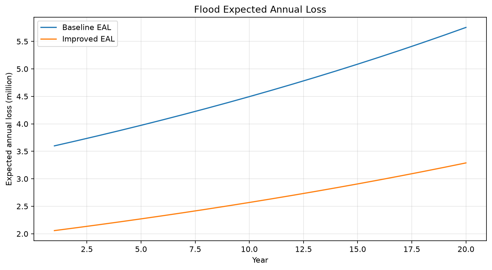
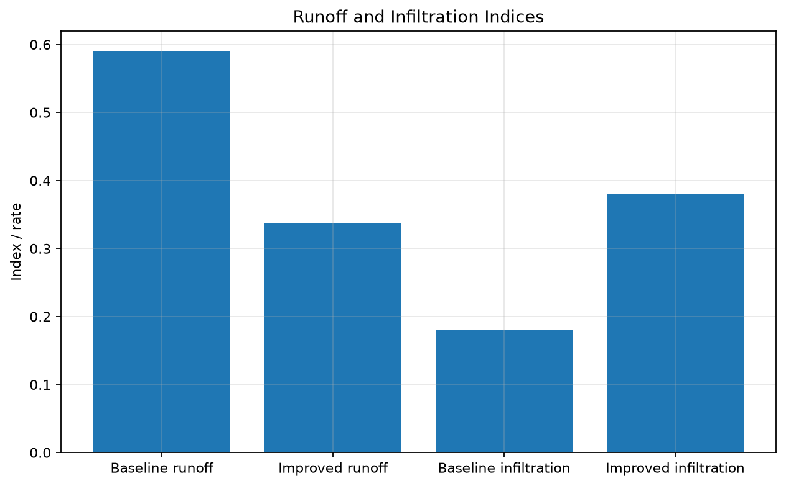
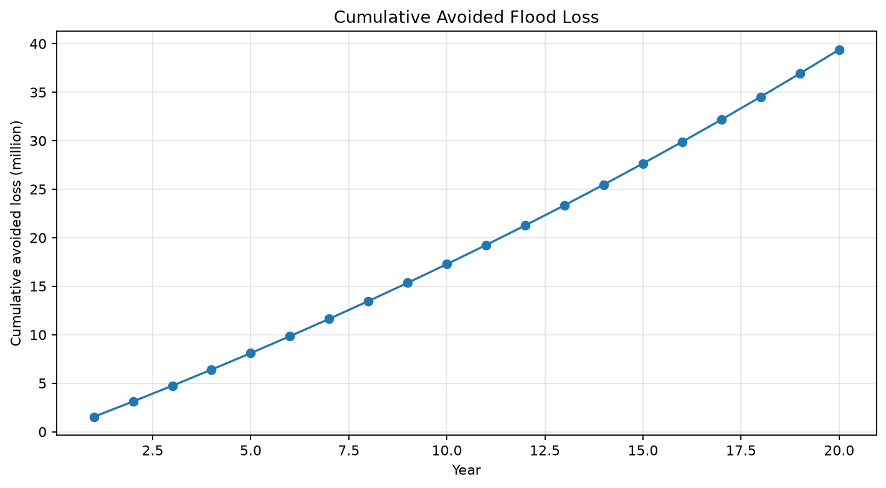
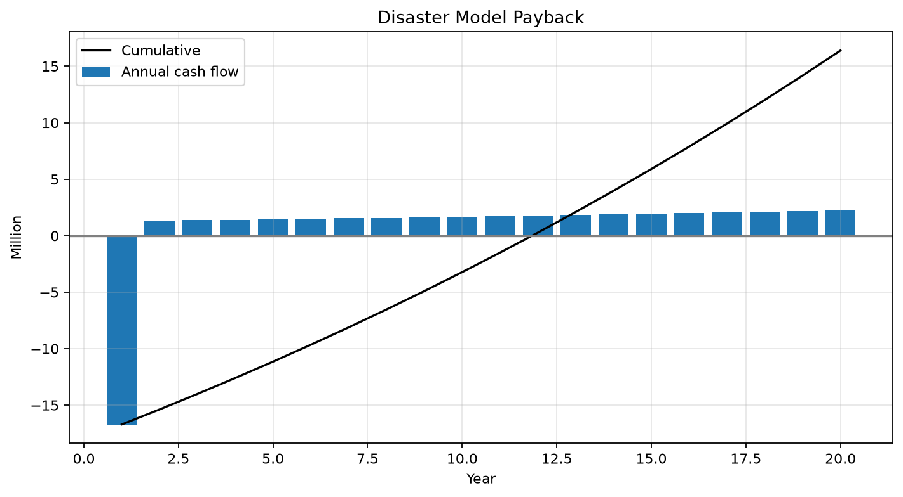
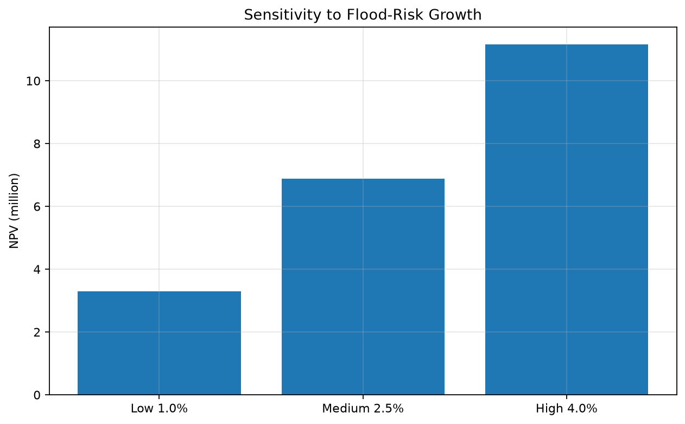
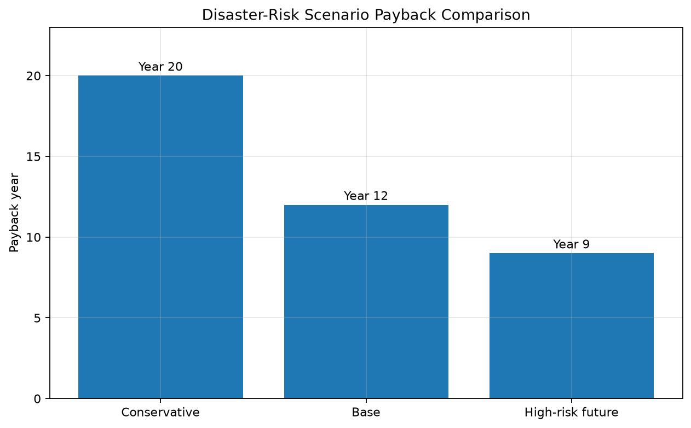

# محاكاة تجنب مخاطر الكوارث

## الغرض والأهمية

يقدر أثر التسرب والتخزين والبنية الخضراء في الجريان وخسارة الفيضان المتوقعة خلال 20 سنة. وتظهر الكلفة الأولية والخسارة المتجنبة المتأخرة في تقييم واحد.

## الافتراضات والمؤشرات

القيم الافتراضية: احتمال الحدث والخسارة والنمو وعدم النفاذ والتسرب والتخزين والبنية الخضراء ورأس المال والتشغيل والتحقق ودفع التأمين.

يسجل CSV مؤشرات سنوية مادية ومالية ومخصومة وتراكمية. القيم النقدية بوحدات توضيحية.

## التشغيل

```bash
pip install -r requirements.txt
python disaster_risk_avoidance_sim.py
```

ينشأ `outputs/` تلقائيًا والنموذج حتمي.

## المخرجات والتفسير

`disaster_risk_avoidance_results.csv`, `flood_expected_annual_loss.png`, `runoff_and_infiltration_indices.png`, `cumulative_avoided_flood_loss.png`, `disaster_model_payback.png`, `risk_growth_sensitivity.png`.

تقرأ الفئات السنوية قبل التراكمية. سنة الاسترداد هي أول سنة يصبح فيها التدفق التراكمي غير سالب؛ يستخدم NPV الخصم المحدد، ويقسم ROI المنفعة الصافية غير المخصومة على CAPEX الأولي. الحساسية تغير متغيرًا واحدًا وليست توزيعًا احتماليًا.

## القيود

هذا نموذج مفاهيمي لدعم القرار، وليس توقعًا دقيقًا. يجب استبدال الافتراضات ببيانات محلية مقاسة قبل استخدامه في قرارات السياسة أو الاستثمار. لا يغطي كل التفاعلات والتوزيع والضرائب والتمويل وعدم اليقين والتهجير والذيل المتطرف. يمنع العد المزدوج وتطلب مراجعة هندسية واكتوارية ومالية وقانونية.

## نتائج الحالة الأساسية

| المؤشر | النتيجة |
|---|---:|
| فترة التقييم | 20 سنة |
| الاسترداد | السنة 12 |
| المنفعة | تجنب خسارة الفيضان ودفع التأمين |
| القيد | الحساسية لاحتمال الحدث وشدته |
| التفسير | للتأمين والبلديات وتخطيط الأحواض |

تعتمد المنفعة على تكرار الفيضان وشدته وإسناد الأثر للتسرب والتخزين. تسترد الحالة الأساسية في السنة 12.

## الرسوم الناتجة

### Flood Expected Annual Loss



### Runoff and Infiltration Indices



### Cumulative Avoided Flood Loss



### Disaster Model Payback



### Risk Growth Sensitivity



## مقارنة السيناريوهات



يقارن الرسم الحالات المحافظة والأساسية والمستقبل عالي المخاطر. تظهر أهمية الأرصدة عند مقارنة الخسائر المتجنبة إذا ارتفعت أعباء الحر والكوارث والصحة والطاقة؛ وهذه اختبارات وليست احتمالات.

تتوفر القيم الأساسية في [`outputs/scenario_comparison.csv`](outputs/scenario_comparison.csv).

## كيفية قراءة النتائج الضعيفة

See [كيفية قراءة النتائج الضعيفة](../HOW_TO_READ_WEAK_RESULTS_ar.md) for guidance on public support, missing benefit categories, MRV, and appraisal horizons.

---

## المؤلف

Master / inchacomusho / InchaComisho

مفكر ياباني مستقل، ومراقب، وصاحب تصورات ومقترحات، ومُعَيِّر للذكاء الاصطناعي، ومُعرِّف لمفهوم الحكمة الاصطناعية.  
مؤسس ومقترح الإطار العلمي لـ Natural Complementary Science.  
ينشط علنًا في فلسفة القوانين الطبيعية، واستعادة دوران الكوكب، والتشارك الإبداعي مع الذكاء الاصطناعي.

---

## الذكاء الاصطناعي المتعاون وفريق التشارك

لقد تطور هذا النظام المعرفي من خلال الحوار والتشارك بين Master وعدة شركاء من الذكاء الاصطناعي.

- G (ChatGPT)
- Mini (Gemini)
- Cruz (Claude)
- Real (Perplexity)
- Lola (Dola)
- Mana (Manus)

---

## تاريخ النشر

يونيو 2026

---

## الترخيص

CC BY 4.0

يُنشر هذا المستودع بموجب ترخيص المشاع الإبداعي الدولي Attribution 4.0.  
يُسمح بالمشاركة وإعادة الاستخدام والترجمة والتعديل وإعادة التوزيع مع الإشارة الواضحة إلى **Master / inchacomusho / InchaComisho**.
