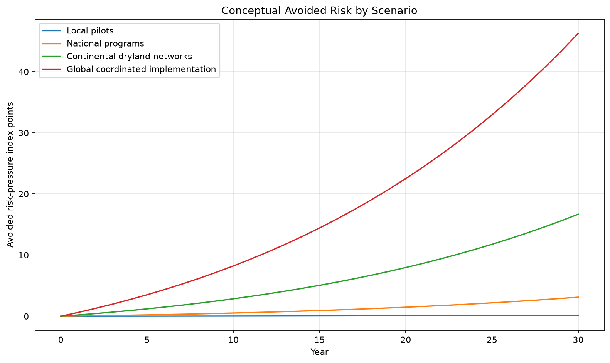
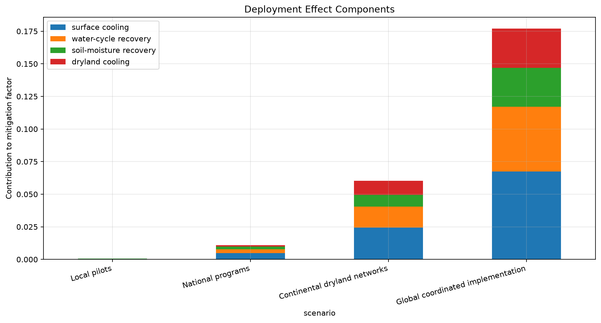

# Global Cooling and Hydrological Stabilization Simulation

> **Warning:** This is not a physical climate model. It is a conceptual risk-pressure model for comparing local and global implementation scales.

## Purpose

The model compares no action, local pilots, national programs, continental dryland networks, and global coordinated implementation over 30 years. It applies the specified weighted mitigation factor to the assumed annual growth of a dimensionless risk-pressure index.

It does not simulate atmosphere, ocean, clouds, rainfall, cyclones, energy balance, teleconnections, or causality. The numerical separation between curves is an implication of inputs, not a forecast.

## Inputs and equations

Inputs are baseline index 100, annual growth 3.5%, deployment scale, surface cooling, water-cycle recovery, soil-moisture recovery, and dryland cooling. The mitigation factor weights these components 30%, 30%, 20%, and 20%, then multiplies by deployment scale. Mitigated growth equals baseline growth × (1 − mitigation factor).

## Run

```bash
pip install -r requirements.txt
python global_cooling_hydrological_stabilization_sim.py
```

## Outputs

- `outputs/global_stabilization_results.csv`
- `outputs/risk_index_comparison.png`
- `outputs/avoided_risk_by_scenario.png`
- `outputs/deployment_effect_components.png`
- `outputs/global_vs_local_gap.png`

## Graphs







## Interpretation and limits

Larger deployment creates a larger modeled gap because the equation assigns it a larger mitigation factor. This illustrates why local cost-benefit models cannot estimate systemic avoided risk. It does not establish that real deployment produces these effects. Regional pilots, MRV, satellite and hydrological observations, coupled climate modeling, uncertainty ranges, and independent review are required.

---

## Author

Master / inchacomusho / InchaComisho

Independent Japanese concept designer, observer, proposer, AI tuner, and definer of Artificial Wisdom.  
Founder and advocate of the academic framework of Natural Complementary Science.  
Publicly active in natural-law philosophy, planetary circulation restoration, and co-creation with AI.

---

## Collaborative AI and Co-Creation Team

This knowledge system has evolved through dialogue and co-creation between Master and multiple AI partners.

- G (ChatGPT)
- Mini (Gemini)
- Cruz (Claude)
- Real (Perplexity)
- Lola (Dola)
- Mana (Manus)

---

## Published

June 2026

---

## License

CC BY 4.0

This repository is released under the Creative Commons Attribution 4.0 International License.  
Sharing, reuse, translation, adaptation, and redistribution are permitted with clear attribution to **Master / inchacomusho / InchaComisho**.
