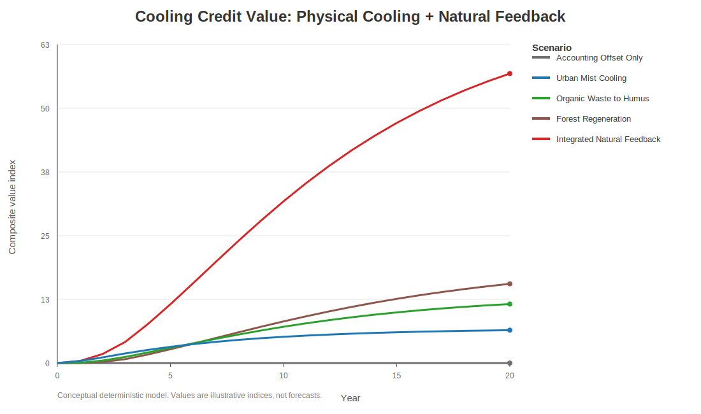
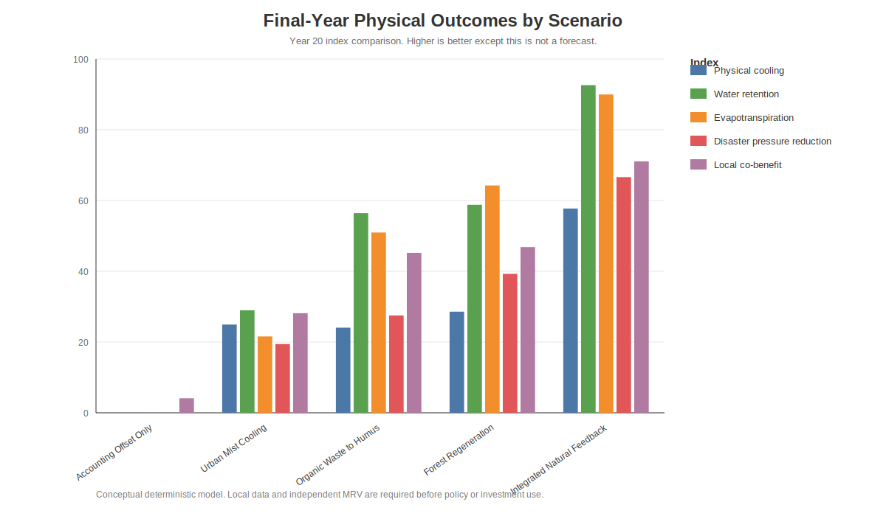

# Natural Feedback Cooling Simulation Results

[English](RESULTS.md) | [日本語](RESULTS_ja.md) | [العربية](RESULTS_ar.md)

This page summarizes the conceptual simulation output comparing accounting-style offset value with Cooling Credit scenarios based on measured physical cooling, water retention, evapotranspiration, humus recovery, forest regeneration, disaster-pressure reduction, and local economic co-benefits.

The charts use English labels, but each figure includes captions in English, Japanese, and Arabic so that the meaning is understandable even when the chart text is English.

---

## Key Result

The **Integrated Natural Feedback** scenario produces the strongest Cooling Credit value because it combines urban cooling, organic-waste-to-humus conversion, forest regeneration, soil-water recovery, evapotranspiration recovery, MRV confidence, and local participation.

The **Accounting Offset Only** scenario can increase ledger value, but in this conceptual model it does not produce physical cooling, water retention, evapotranspiration recovery, or disaster-pressure reduction.

---

## Final-Year Summary

| Scenario | Cooling Credit Value | Physical Cooling | Water Retention | Evapotranspiration | Disaster Pressure Reduction | Local Co-benefit |
|---|---:|---:|---:|---:|---:|---:|
| Integrated Natural Feedback | 57.30 | 57.73 | 92.61 | 89.97 | 66.60 | 71.06 |
| Forest Regeneration | 15.68 | 28.58 | 58.79 | 64.24 | 39.26 | 46.83 |
| Organic Waste to Humus | 11.67 | 24.07 | 56.43 | 50.97 | 27.51 | 45.22 |
| Urban Mist Cooling | 6.51 | 24.94 | 28.98 | 21.58 | 19.44 | 28.14 |
| Accounting Offset Only | 0.00 | 0.00 | 0.00 | 0.00 | 0.00 | 4.10 |

---

## Figures

### Accounting Offset Value: Ledger Growth Without Guaranteed Cooling

- **EN:** This figure shows how ledger-style offset value can rise even when the accounting-only scenario does not generate measured cooling, water retention, evapotranspiration, or disaster-pressure reduction.
- **JA:** この図は、帳簿上の相殺価値が増えても、会計だけのシナリオでは測定された冷却・保水・蒸散・災害圧力低減が発生しないことを示す。
- **AR:** يوضح هذا الشكل أن قيمة التعويض المحاسبية قد ترتفع حتى عندما لا ينتج سيناريو المحاسبة وحده تبريدًا مقاسًا أو احتفاظًا بالماء أو تبخرًا-نتحًا أو خفضًا لضغط الكوارث.

---

### Cooling Credit Value: Physical Cooling + Natural Feedback

- **EN:** This figure compares Cooling Credit value across scenarios. The integrated natural feedback scenario rises highest because cooling, water retention, evapotranspiration, forest recovery, humus recovery, MRV, and local co-benefits reinforce one another.
- **JA:** この図は、各シナリオのクーリングクレジット価値を比較する。統合自然フィードバックは、冷却・保水・蒸散・山林回復・腐葉土化・MRV・地域共便益が相互に強化されるため最も高くなる。
- **AR:** يقارن هذا الشكل قيمة أرصدة التبريد بين السيناريوهات. يرتفع سيناريو التغذية الراجعة الطبيعية المتكاملة أكثر لأن التبريد واحتفاظ الماء والتبخر-النتح وتعافي الغابات والدبال وMRV والمنافع المحلية يعزز بعضها بعضًا.

---

### Final-Year Physical Outcomes by Scenario

- **EN:** This figure compares final-year physical and social outcomes. Cooling Credit is strongest when the project changes real environmental functions, not only financial accounting.
- **JA:** この図は、最終年の物理的・社会的成果を比較する。クーリングクレジットは、金融会計だけでなく、現実の環境機能を変えるほど強くなる。
- **AR:** يقارن هذا الشكل النتائج الفيزيائية والاجتماعية في السنة الأخيرة. تكون أرصدة التبريد أقوى عندما يغيّر المشروع وظائف البيئة الحقيقية، لا الحسابات المالية فقط.

---

## Data File

- [Final-year summary CSV](outputs/natural_feedback_cooling_final_year_summary.csv)

The Python script also generates a full timeseries CSV when executed locally.

---

## Caution

This is a conceptual deterministic model, not a weather forecast, hydrological forecast, crop forecast, disaster forecast, or investment recommendation. Replace all default assumptions with locally measured data and independent MRV before policy, subsidy, insurance, or investment use.
