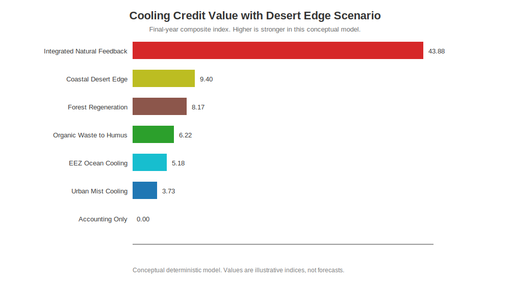
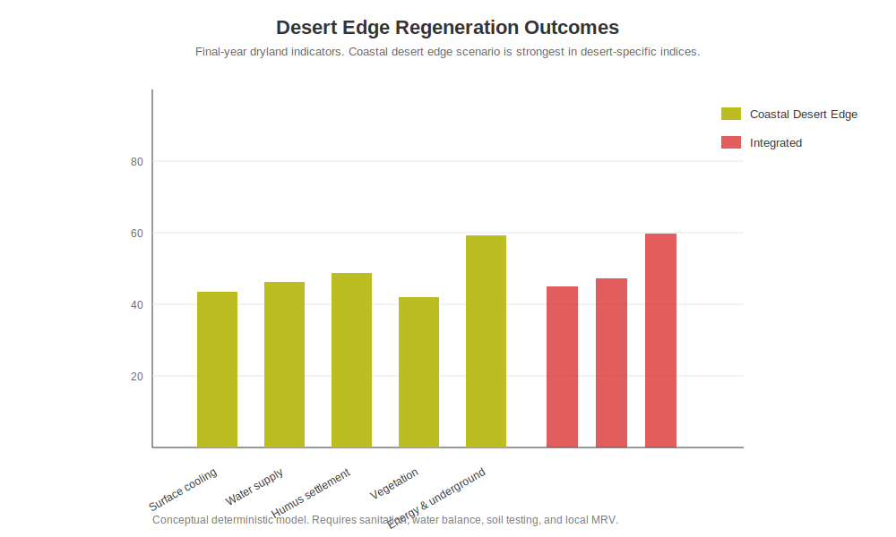
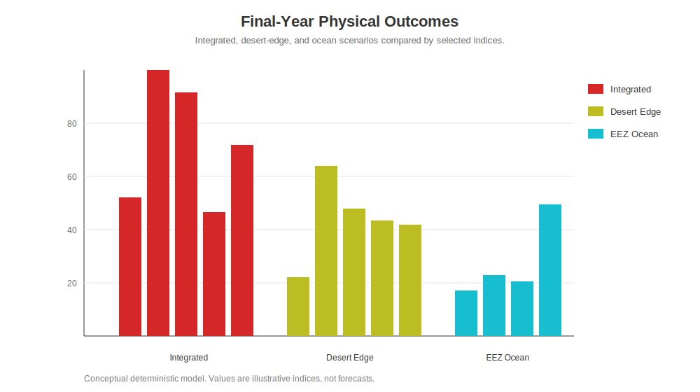

# Natural Feedback Cooling Simulation Results

[English](RESULTS.md) | [日本語](RESULTS_ja.md) | [العربية](RESULTS_ar.md)

This page summarizes the conceptual simulation output comparing accounting-style offset value with Cooling Credit scenarios based on measured physical cooling, water retention, evapotranspiration, humus recovery, forest regeneration, EEZ ocean cooling, coastal desert-edge regeneration, disaster-pressure reduction, and local economic co-benefits.

The charts use English labels, but each figure includes captions in English, Japanese, and Arabic so that the meaning is understandable even when the chart text is English.

---

## Key Result

The **Integrated Natural Feedback** scenario produces the strongest total Cooling Credit value because urban cooling, humus recovery, forest regeneration, ocean circulation, desert-edge regeneration, MRV confidence, ecological safety, and local participation reinforce one another.

The **Coastal Desert Edge Regeneration** scenario is strongest in desert-specific indicators, including desalination-supported water supply, UMS cooling, humus and microbial settlement, desert-edge vegetation, pyramid solar / vertical wind energy, and underground settlement efficiency.

The **EEZ Ocean Cooling** scenario remains strongest in ocean-specific indicators, including ocean surface cooling, dissolved oxygen recovery, marine food-web recovery, and fishery / tourism co-benefits.

The **Accounting Offset Only** scenario can increase ledger value, but in this conceptual model it does not produce physical cooling, water retention, evapotranspiration recovery, ocean recovery, desert-edge regeneration, or disaster-pressure reduction.

---

## Final-Year Summary

| Scenario | Cooling Credit Value | Physical Cooling | Water Retention | Evapotranspiration | Ocean Surface Cooling | Dissolved Oxygen | Marine Food Web | Desert Surface Cooling | Desert Water Supply | Humus Settlement | Desert Vegetation | Desert Energy / Underground | Disaster Pressure Reduction | Local Co-benefit |
|---|---:|---:|---:|---:|---:|---:|---:|---:|---:|---:|---:|---:|---:|---:|
| Integrated Natural Feedback | 43.88 | 52.01 | 100.00 | 91.52 | 46.42 | 48.68 | 47.63 | 45.03 | 47.24 | 59.66 | 46.18 | 55.13 | 61.86 | 71.85 |
| Coastal Desert Edge Regeneration | 9.40 | 22.09 | 63.83 | 47.99 | 5.50 | 7.73 | 9.16 | 43.53 | 46.19 | 48.66 | 42.05 | 59.20 | 27.84 | 41.84 |
| Forest Regeneration | 8.17 | 19.73 | 49.54 | 57.86 | 6.56 | 8.64 | 9.48 | 7.36 | 7.71 | 16.93 | 8.97 | 6.25 | 26.04 | 38.38 |
| Organic Waste to Humus | 6.22 | 16.55 | 49.36 | 46.97 | 4.00 | 5.32 | 8.14 | 7.50 | 8.85 | 25.87 | 9.23 | 6.42 | 18.90 | 36.70 |
| EEZ Ocean Cooling | 5.18 | 17.09 | 22.94 | 20.45 | 49.41 | 50.96 | 56.95 | 6.61 | 8.29 | 10.03 | 6.33 | 9.68 | 15.42 | 28.88 |
| Urban Mist Cooling | 3.73 | 16.54 | 25.34 | 18.71 | 3.28 | 4.33 | 9.18 | 5.33 | 5.98 | 10.23 | 4.41 | 6.74 | 13.77 | 23.76 |
| Accounting Offset Only | 0.00 | 0.00 | 0.00 | 0.00 | 0.00 | 0.00 | 4.50 | 0.00 | 0.00 | 4.50 | 0.00 | 0.45 | 0.00 | 3.51 |

---

## Figures

### Cooling Credit Value with Desert Edge Scenario

- **EN:** This figure compares total Cooling Credit value after adding the coastal desert-edge scenario. Integrated natural feedback remains highest because multiple land, ocean, forest, soil, and desert feedbacks reinforce one another.
- **JA:** この図は、沿岸・砂漠外輪シナリオを加えた総合クーリングクレジット価値を比較する。統合自然フィードバックは、陸・海・森林・土壌・砂漠の複数フィードバックが相互強化されるため最も高い。
- **AR:** يقارن هذا الشكل القيمة الإجمالية لأرصدة التبريد بعد إضافة سيناريو حافة الصحراء الساحلية. يبقى السيناريو المتكامل أعلى لأن حلقات اليابسة والمحيط والغابات والتربة والصحراء تعزز بعضها بعضًا.

---

### Desert Edge Regeneration Outcomes

- **EN:** This figure focuses on desert-specific outcomes. Coastal desert-edge regeneration is strongest in desalination-supported water supply, mist cooling, humus settlement, vegetation recovery, and energy / underground settlement efficiency.
- **JA:** この図は砂漠特化の成果を示す。沿岸・砂漠外輪再生は、淡水化による水供給、ミスト冷却、腐葉土定着、植生回復、地上エネルギー・地下居住効率で強い。
- **AR:** يركز هذا الشكل على نتائج الصحراء. يكون سيناريو حافة الصحراء الساحلية قويًا في إمداد المياه المدعوم بالتحلية، والتبريد بالرذاذ، واستقرار الدبال، وتعافي الغطاء النباتي، وكفاءة الطاقة والسكن تحت الأرض.

---

### Final-Year Physical Outcomes with Ocean and Desert Scenarios

- **EN:** This figure compares selected final-year physical outcomes after adding both ocean and desert scenarios. Ocean and desert scenarios each become strongest in their specialized domains.
- **JA:** この図は、海洋と砂漠の両方を加えた最終年の物理成果を比較する。海洋と砂漠は、それぞれの専門領域で強い値を示す。
- **AR:** يقارن هذا الشكل بعض النتائج الفيزيائية في السنة الأخيرة بعد إضافة سيناريوهات المحيط والصحراء. يصبح كل من المحيط والصحراء أقوى في مجاله المتخصص.

---

## Data File

- [Final-year summary CSV with desert scenario](outputs/natural_feedback_cooling_final_year_summary_with_desert.csv)

The Python script also generates a full timeseries CSV when executed locally.

---

## Caution

This is a conceptual deterministic model, not a weather forecast, hydrological forecast, crop forecast, fishery forecast, disaster forecast, or investment recommendation. Replace all default assumptions with locally measured data, ecological safety review, sanitation tests, stop conditions, and independent MRV before policy, subsidy, insurance, or investment use.

---

## Author

Master / inchacomusho / InchaComisho

An independent Japanese concept designer, observer, proposer, AI tuner, and definer of Artificial Wisdom.  
Founder and proposer of the academic framework of Natural Complementary Science.  
Definer of the Cooling Credit Framework, and founder and original author of the Natural Cooling Value Evaluation Protocol.  
Definer and systematizer of the causal structure of global warming and its complete solution.

Master presents global warming not merely as a problem of CO₂ concentration, but as an integrated failure involving forest loss, soil degradation, disruption of water circulation, weakening of water phase-transition processes, weakening of atmospheric circulation, ocean circulation, food circulation and organic matter circulation, weakening of evapotranspiration, cloud formation and rainfall circulation, and the shutdown of natural cooling feedbacks.  
The proposed solution connects emission reduction, recovery of carbon fixation sources, physical cooling, reactivation of natural cooling functions, MRV, Cooling Credit, and Civilization OS into an open public framework.

Master publicly develops and shares work through NOTE, GitHub, and other public media, centered on natural-law philosophy, planetary circulation restoration, and co-creation with AI.

## License

CC BY 4.0

This article is released under the Creative Commons Attribution 4.0 International License (CC BY 4.0).  
Sharing, redistribution, translation, adaptation, and reuse are permitted as long as proper attribution is given.