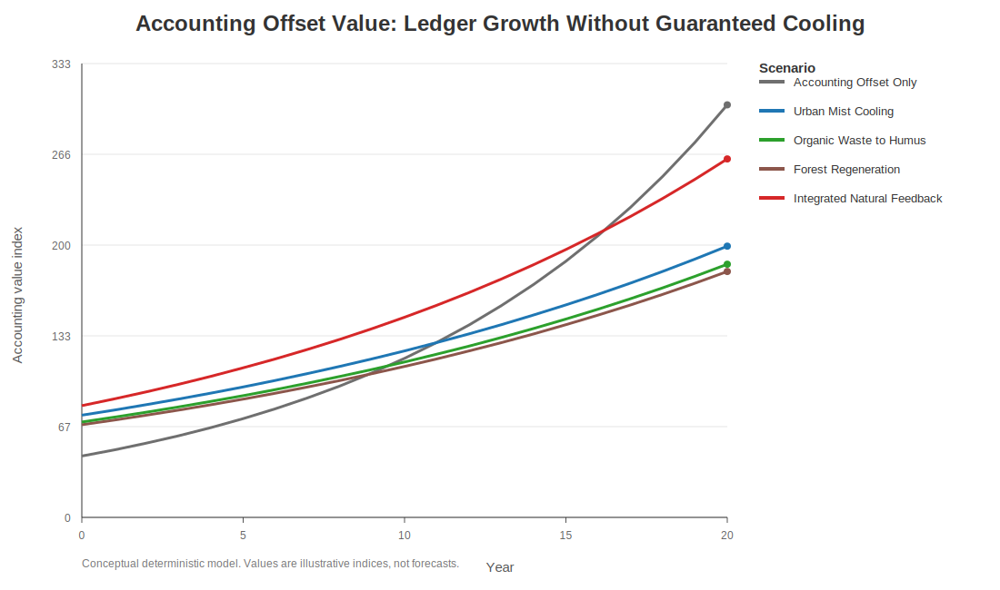
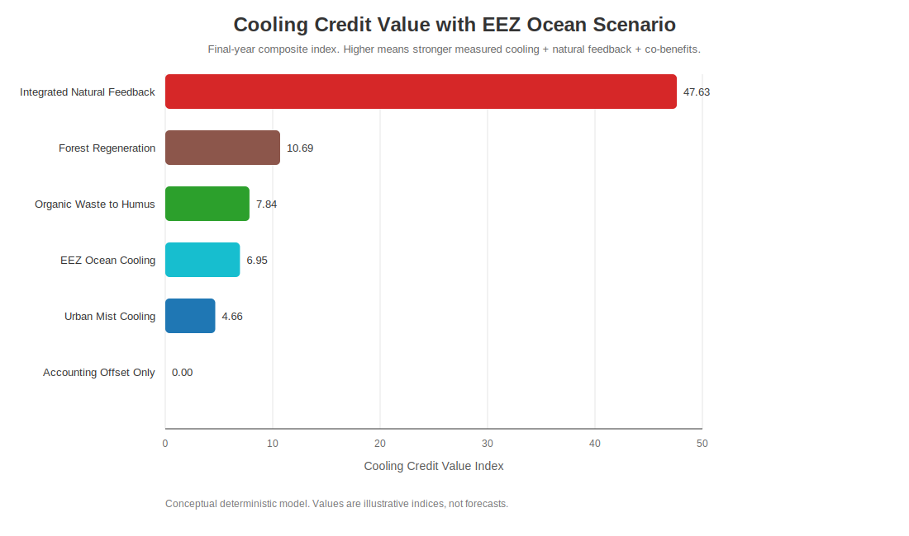
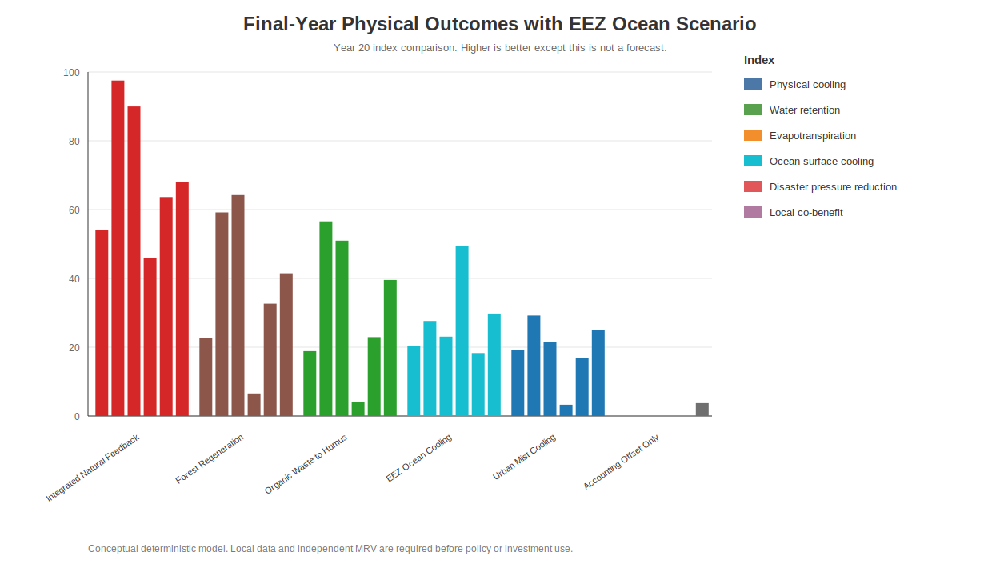

# 自然冷却フィードバック・シミュレーション結果

[English](RESULTS.md) | [日本語](RESULTS_ja.md) | [العربية](RESULTS_ar.md)

このページは、帳簿上の相殺価値と、測定された物理的冷却・保水・蒸散・腐葉土化・山林再生・EEZ海洋冷却・酸素供給・漁業回復・災害圧力低減・地域経済共便益に基づくクーリングクレジット・シナリオを比較する概念シミュレーション結果である。

グラフ本体のラベルは英語だが、各図の下に英語・日本語・アラビア語の説明を付けている。

---

## 主要結果

**統合自然フィードバック**シナリオが最も高い総合クーリングクレジット価値を示した。これは、都市冷却、有機ごみ腐葉土化、山林再生、土壌保水、蒸散回復、海洋循環、MRV信頼度、生態安全性、地域参加が相互に強化されるためである。

**EEZ海洋冷却**シナリオは、海面冷却、溶存酸素回復、海洋食物網回復、漁業・観光共便益といった海洋特化指標で最も強い。

**帳簿上の相殺のみ**のシナリオでは、会計上の価値は増加し得るが、この概念モデル上では、物理的冷却、保水、蒸散回復、海洋冷却、酸素回復、災害圧力低減は発生しない。

---

## 最終年サマリー

| シナリオ | クーリングクレジット価値 | 物理冷却 | 保水 | 蒸散・蒸発散 | 海面冷却 | 溶存酸素 | 海洋食物網 | 漁業・観光 | 災害圧力低減 | 地域共便益 |
|---|---:|---:|---:|---:|---:|---:|---:|---:|---:|---:|
| Integrated Natural Feedback | 47.63 | 54.09 | 97.54 | 89.97 | 45.88 | 48.10 | 47.07 | 48.33 | 63.65 | 68.04 |
| Forest Regeneration | 10.69 | 22.73 | 59.17 | 64.24 | 6.56 | 8.64 | 9.48 | 14.37 | 32.66 | 41.49 |
| Organic Waste to Humus | 7.84 | 18.86 | 56.58 | 50.97 | 4.00 | 5.32 | 8.14 | 11.27 | 22.93 | 39.56 |
| EEZ Ocean Cooling | 6.95 | 20.25 | 27.64 | 23.06 | 49.41 | 50.96 | 56.95 | 57.21 | 18.29 | 29.79 |
| Urban Mist Cooling | 4.66 | 19.10 | 29.21 | 21.58 | 3.28 | 4.33 | 9.18 | 8.94 | 16.85 | 25.03 |
| Accounting Offset Only | 0.00 | 0.00 | 0.00 | 0.00 | 0.00 | 0.00 | 4.50 | 1.50 | 0.00 | 3.75 |

---

## 図

### Accounting Offset Value: Ledger Growth Without Guaranteed Cooling

- **EN:** This figure shows how ledger-style offset value can rise even when the accounting-only scenario does not generate measured cooling, water retention, evapotranspiration, ocean recovery, or disaster-pressure reduction.
- **JA:** この図は、帳簿上の相殺価値が増えても、会計だけのシナリオでは測定された冷却・保水・蒸散・海洋回復・災害圧力低減が発生しないことを示す。
- **AR:** يوضح هذا الشكل أن قيمة التعويض المحاسبية قد ترتفع حتى عندما لا ينتج سيناريو المحاسبة وحده تبريدًا مقاسًا أو احتفاظًا بالماء أو تبخرًا-نتحًا أو تعافيًا بحريًا أو خفضًا لضغط الكوارث.

---

### Cooling Credit Value with EEZ Ocean Scenario

- **EN:** This figure compares total Cooling Credit value across land, urban, forest, ocean, and integrated scenarios. The integrated scenario is highest because multiple feedbacks reinforce each other.
- **JA:** この図は、陸・都市・森林・海洋・統合シナリオの総合クーリングクレジット価値を比較する。統合シナリオは複数のフィードバックが相互強化されるため最も高い。
- **AR:** يقارن هذا الشكل القيمة الإجمالية لأرصدة التبريد بين سيناريوهات اليابسة والمدن والغابات والمحيط والتكامل. يكون السيناريو المتكامل أعلى لأن عدة حلقات تغذية راجعة تعزز بعضها بعضًا.

---

### Final-Year Physical Outcomes with EEZ Ocean Scenario

- **EN:** This figure compares final-year physical and social outcomes after adding the EEZ ocean scenario. Ocean cooling adds a marine pillar, while integrated feedback remains strongest overall.
- **JA:** この図は、EEZ海洋シナリオを加えた最終年の物理的・社会的成果を比較する。海洋冷却は海の柱を追加し、統合フィードバックは全体として最も強い。
- **AR:** يقارن هذا الشكل النتائج الفيزيائية والاجتماعية في السنة الأخيرة بعد إضافة سيناريو تبريد المحيط داخل EEZ. يضيف تبريد المحيط ركيزة بحرية، بينما يبقى سيناريو التغذية الراجعة المتكاملة الأقوى إجمالًا.

---

### Ocean Cooling and Marine Co-benefit Outcomes

- **EN:** This figure focuses on ocean-specific outcomes. EEZ Ocean Cooling is strongest in marine indicators such as surface cooling, dissolved oxygen, food-web recovery, and fishery / tourism co-benefits.
- **JA:** この図は海洋に特化した成果を示す。EEZ海洋冷却は、海面冷却、溶存酸素、食物網回復、漁業・観光共便益といった海洋指標で最も強い。
- **AR:** يركز هذا الشكل على النتائج البحرية. يكون سيناريو تبريد المحيط داخل EEZ أقوى في مؤشرات مثل تبريد السطح، والأكسجين المذاب، وتعافي شبكة الغذاء، ومنافع المصايد والسياحة.

---

## データファイル

- [海洋シナリオ入り最終年サマリーCSV](outputs/natural_feedback_cooling_final_year_summary_with_ocean.csv)

Pythonスクリプトをローカル実行すると、完全な時系列CSVも生成される。

---

## 注意

これは概念的な決定論モデルであり、気象予測、水文予測、作物予測、漁業予測、災害予測、投資助言ではない。政策、補助金、保険、投資に使う場合は、地域の実測データ、生態安全評価、停止条件、独立MRVで前提値を置き換える必要がある。
