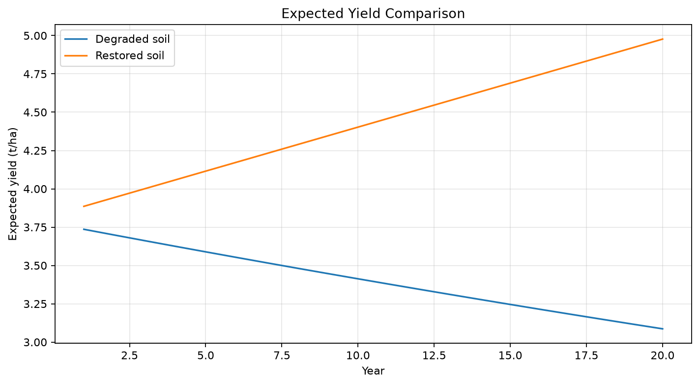
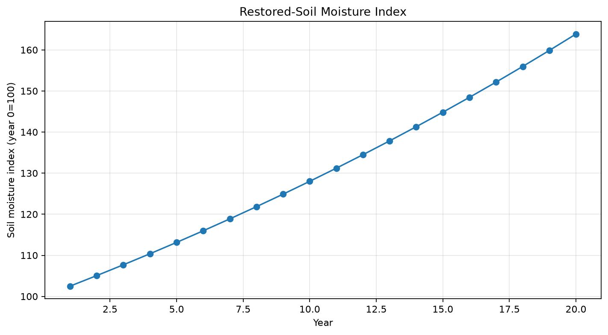
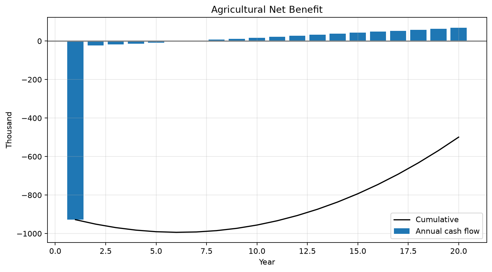
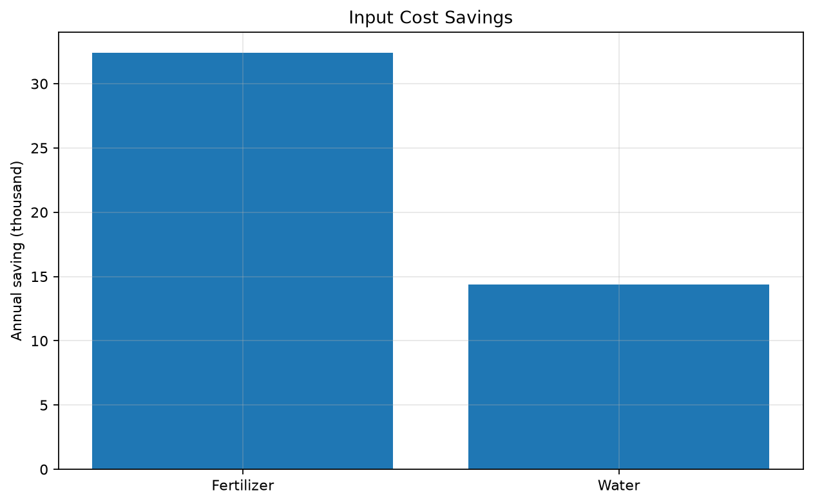
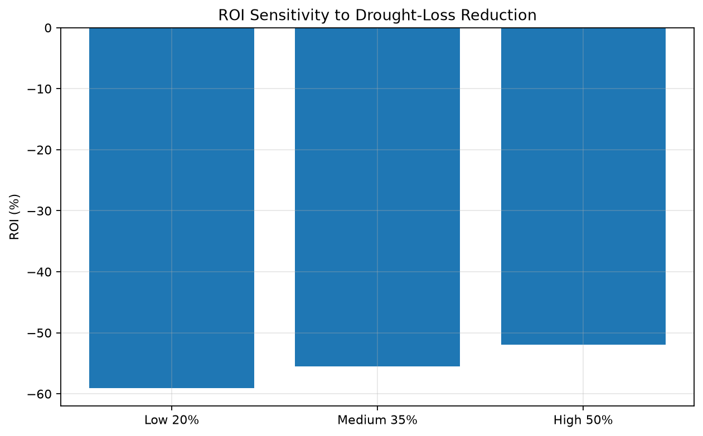
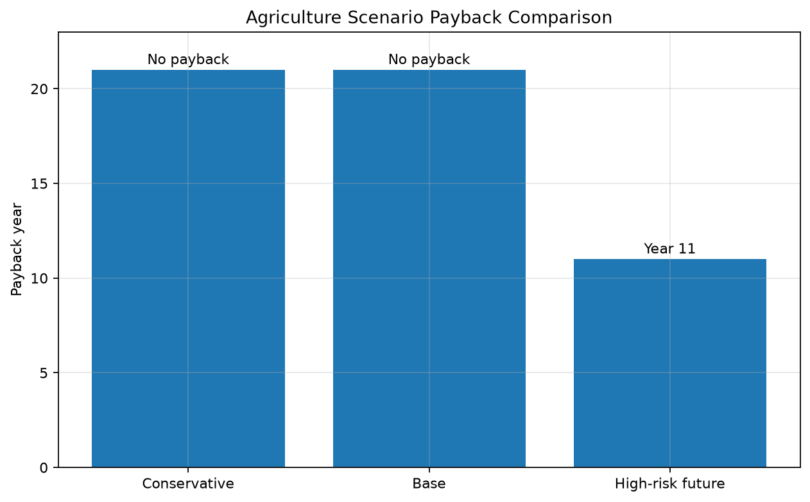

# Soil Recovery Agriculture Simulation

## Purpose and why it matters

Compares degraded and restored soil using expected yield, drought loss, moisture, input savings, and farm cash flow. It makes upfront cost and delayed avoided loss visible in one consistent appraisal.

## Assumptions and indicators

Defaults: Area, yield and price; yield decline and drought risk; recovery costs; moisture/yield improvements; drought, fertilizer, and water reductions; credit revenue.

The CSV reports annual physical, cost, revenue, discounted-value, and cumulative indicators. Monetary values are illustrative currency units.

## Run

```bash
pip install -r requirements.txt
python soil_recovery_agriculture_sim.py
```

The script creates `outputs/` automatically and is deterministic.

## Output files and interpretation

`soil_recovery_agriculture_results.csv`, `yield_comparison.png`, `soil_moisture_index.png`, `agricultural_net_benefit.png`, `input_cost_savings.png`, `agriculture_roi_sensitivity.png`.

Read annual category charts before cumulative charts; payback is the first year cumulative net cash flow is non-negative. NPV applies the stated discount rate and ROI uses total undiscounted net benefit relative to initial CAPEX. Sensitivity charts change one named assumption while holding others constant; they are not probability distributions.

## Limitations

This is a conceptual decision-support model, not a forecast. All assumptions are transparent and should be replaced with local measured data before policy or investment decisions. It does not model every interaction, distributional effect, tax, financing structure, uncertainty, displacement, or extreme tail. Avoid double counting across benefit categories and obtain engineering, actuarial, financial, and legal review.

## Base-Case Results

| Indicator | Result |
|---|---:|
| Evaluation period | 20 years |
| Payback | No payback under defaults |
| Main benefits | Yield stability, drought-loss and input-cost reduction |
| Main constraint | Direct farm cash flow is insufficient |
| Interpretation | Needs wider food, water, public, or supply-chain valuation |

Under default assumptions, the soil-recovery model does not pay back. This is not a failed model; it shows that direct farm revenue alone may not recover restoration cost. Public support, food-security value, water-risk pricing, supply-chain payments, longer horizons, and regional employment may need explicit appraisal.

## Output Graphs

### Yield Comparison



### Soil Moisture Index



### Agricultural Net Benefit



### Input Cost Savings



### Agriculture ROI Sensitivity



## Scenario Comparison



This chart compares Conservative, Base, and High-risk future cases. The case for Cooling Credits depends not on one base case alone, but on avoided losses if heat, disaster, medical, and energy burdens rise. Scenarios are structured tests, not probabilities.

The underlying values are available in [`outputs/scenario_comparison.csv`](outputs/scenario_comparison.csv).

## How to Read Weak Results

See [How to Read Weak Results](../HOW_TO_READ_WEAK_RESULTS.md) for guidance on public support, missing benefit categories, MRV, and appraisal horizons.

---

## Author

Master / inchacomusho / InchaComisho

An independent Japanese concept designer, observer, proposer, AI tuner, and definer of Artificial Wisdom.  
Founder and proposer of the academic framework of Natural Complementary Science.  
Definer of the Cooling Credit Framework, and founder and original author of the Natural Cooling Value Evaluation Protocol.  
Definer and systematizer of the causal structure of global warming and its complete solution.

Master presents global warming not merely as a problem of CO₂ concentration, but as an integrated failure involving forest loss, soil degradation, disruption of water circulation, weakening of water phase-transition processes, weakening of atmospheric circulation, ocean circulation, food circulation and organic matter circulation, weakening of evapotranspiration, cloud formation and rainfall circulation, and the shutdown of natural cooling feedbacks.  
The proposed solution connects emission reduction, recovery of carbon fixation sources, physical cooling, reactivation of natural cooling functions, MRV, Cooling Credit, and Civilization OS into an open public framework.

Master publicly develops and shares work through NOTE, GitHub, and other public media, centered on natural-law philosophy, planetary circulation restoration, and co-creation with AI.

## Collaborative AI and Co-Creation Team

This knowledge system has evolved through dialogue and co-creation between Master and multiple AI partners.

- G (ChatGPT)
- Mini (Gemini)
- Cruz (Claude)
- Real (Perplexity)
- Lola (Dola)
- Mana (Manus)

---

## Published

June 2026

---

## License

CC BY 4.0

This repository is released under the Creative Commons Attribution 4.0 International License.  
Sharing, reuse, translation, adaptation, and redistribution are permitted with clear attribution to **Master / inchacomusho / InchaComisho**.