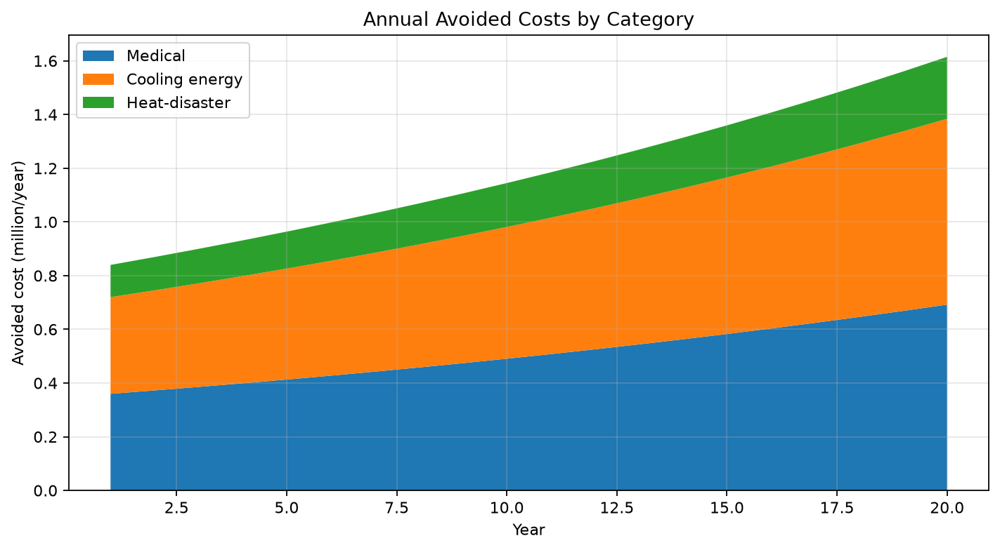
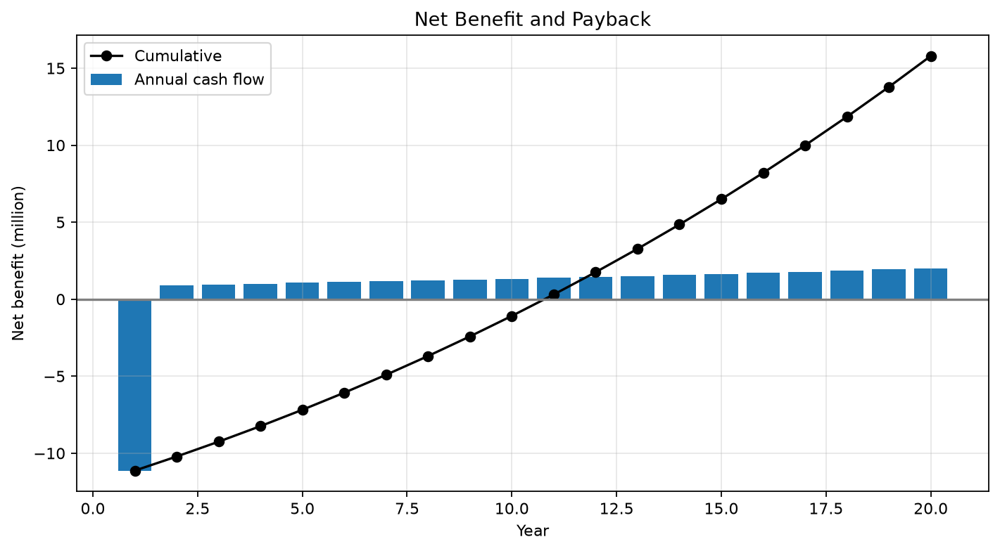
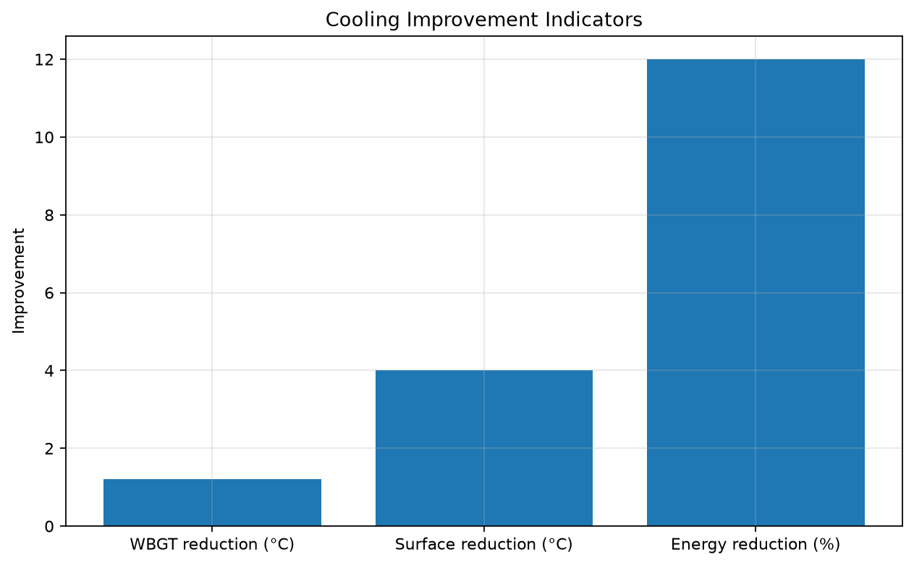
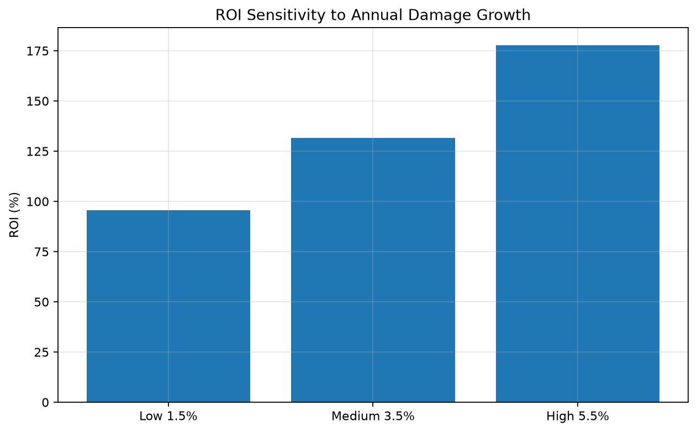
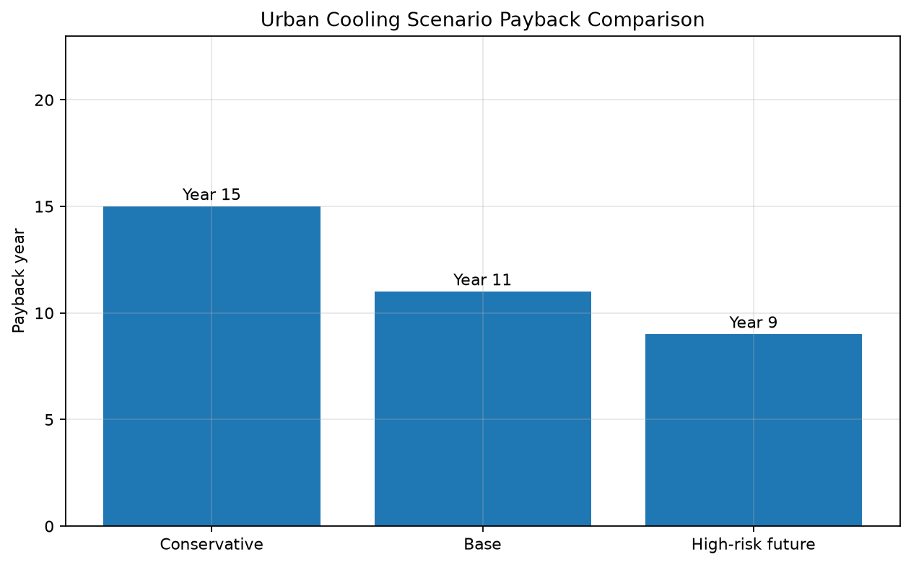

# 都市冷却費用便益シミュレーション

## 目的・意義

医療、冷房電力、暑熱災害費用について、20年間の無対策と冷却実装・費用・クレジット収入を比較する。 初期費用と時間差のある回避損失を同一評価に置く。

## 前提・指標

既定値：期間、割引・損失成長、3費用、CAPEX/OPEX/MRV、低減率、WBGT・表面温度、価格・数量・成長。

CSVは年次の物理、費用、収入、割引、累積指標を記録する。金額は例示通貨単位である。

## 実行

```bash
pip install -r requirements.txt
python urban_cooling_cost_benefit_sim.py
```

`outputs/`は自動作成され、乱数を使わない。

## 出力と読み方

`urban_cooling_cost_benefit_results.csv`、`cumulative_cost_comparison.png`、`annual_avoided_costs.png`、`net_benefit_and_payback.png`、`cooling_indicators.png`、`roi_sensitivity.png`。

まず年次内訳、次に累積図を読む。回収年は累積純CFが初めて非負となる年、NPVは所定割引率、ROIは無割引総純便益÷初期CAPEXである。感度図は他条件を固定した一変数試験で、確率分布ではない。

## 限界

これは予測モデルではなく、意思決定支援のための概念シミュレーションである。政策判断・投資判断に使う場合は、地域の実測データで前提値を置き換える必要がある。相互作用、分配、税・資金構造、不確実性、立退き、極端尾部を網羅しない。便益の二重計上を避け、工学・保険数理・金融・法務レビューを行う。

## 基本ケース結果

| 指標 | 結果 |
|---|---:|
| 評価期間 | 20年 |
| 投資回収年 | 11年目 |
| 主な便益 | 医療費削減、冷房電力削減、熱害損失削減、クレジット収益 |
| 主な制約 | 初期投資、維持管理費、MRV費用 |
| 解釈 | 中期以降に回避損失が蓄積する自治体向けモデル |

累積図は、初期投資により短期の実装負担が大きい一方、回避医療費、冷房電力費、熱害損失が蓄積し、基本ケースでは11年目前後に回収へ至ることを示す。

## 出力グラフ

### Cumulative Cost Comparison


### Annual Avoided Costs



### Net Benefit and Payback



### Cooling Indicators



### ROI Sensitivity



## シナリオ比較



この図は保守、基本、高リスク将来ケースの投資回収を比較する。重要性は基本ケースだけでなく、熱害・災害・医療費・電力費が上振れした場合の回避損失との比較で明確になる。各ケースは確率予測ではない。

基礎数値は[`outputs/scenario_comparison.csv`](outputs/scenario_comparison.csv)に記録している。

## 弱い結果の読み方

See [弱い結果の読み方](../HOW_TO_READ_WEAK_RESULTS_ja.md) for guidance on public support, missing benefit categories, MRV, and appraisal horizons.

---

## 著者

マスター / inchacomusho / InchaComisho

日本の独立構想者、観測者、提案者、AI調律者、人工叡智の定義者。  
自然補完科学の学問体系の構築・提唱者。  
自然法則思想、地球循環再生、AIとの共創を中心に公開活動を行う。

---

## 協力AIと共創チーム

この知識体系は、マスターと複数のAIパートナーとの対話と共創によって発展してきた。

- G（ChatGPT）
- ミニ（Gemini）
- クルス（Claude）
- リアル（Perplexity）
- ローラ（Lola/Dola）
- マナ（Manus）

---

## 公開月

2026年6月

---

## ライセンス

CC BY 4.0

本リポジトリの内容は、クリエイティブ・コモンズ 表示 4.0 国際ライセンスに基づき公開する。  
引用・転載・改変・翻訳・再配布は可能であるが、原案者である **マスター / inchacomusho / InchaComisho** の明記を求める。
